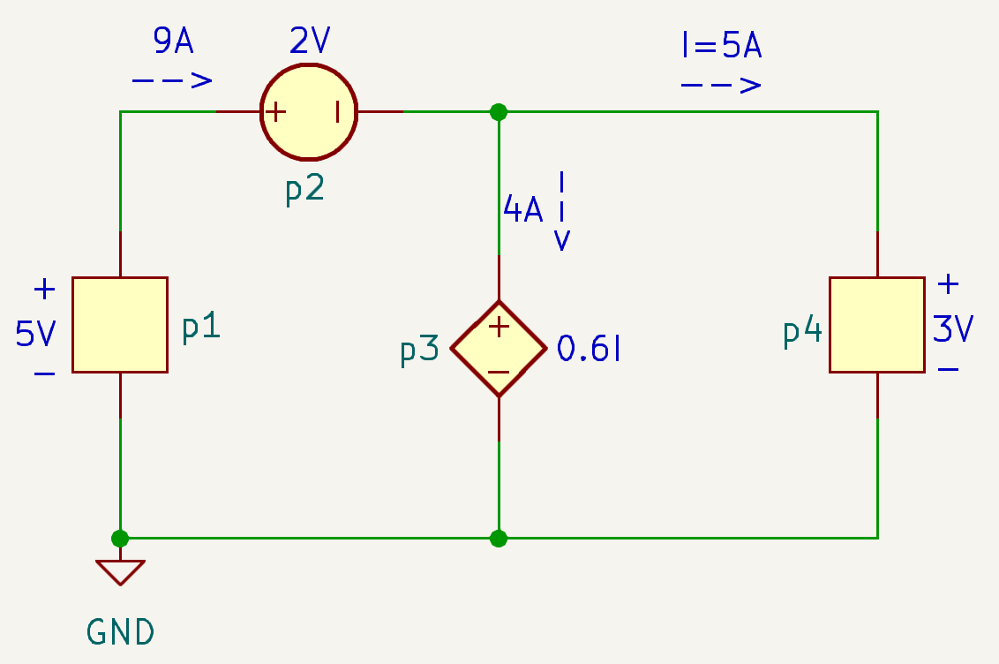

# 电路基本概念

::: info

**1.**  **电路基本概念**（建议4学时）

1.1  绪论

​    1.1.1  课程要求及其参考书籍

​    1.1.2  电子电路的发展历史

1.2  电路基础知识

​    1.2.1  实际电路和电路模型

​    1.2.2  电路基本物理量（包括电荷、电流、电压、功率和能量）

​    1.2.3  电路参数符号书写规范

1.3  基本电路元件

​    1.3.1  电阻、电容和电感（原理、符号及其特性定量描述）

​    1.3.2  独立电源和受控电源（原理、符号及其特性定量描述）

:::

::: tip 

1. 集总参数 vs. 分布参数

   * **集总参数电路**（lumped circuit）: 实际电路的尺寸远小于电路工作时电磁波的波长。【本课程主要考虑集总参数电路】

   * **分布参数电路**（distributed circuit）: 实际电路的尺寸与电路工作时电磁波的波长相当或更大。一般超过**十分之一**波长时需要考虑。如蓝牙工作频率 2.4 GHz， $\frac{1}{10}\lambda \approx \frac{0.3\,Gm/s}{2.4 \,GHz}\times 0.1=12.5mm$, 故蓝牙PCB电路中，铜线超过12.5 mm后需要考虑传输线分布效应

2. 参考方向

   * **电流参考方向**：因事先不知道**流过元件**的实际电流方向，故可假定电流的方向，这一假定的方向即为电流参考方向；

   * **电压参考方向**：因事先不知道**元件两端**电压的高低，故可假定一端电压高（标记为﹢）、另一端电压低（标记为﹣），这一假定的﹢﹣即为电压参考方向；

   * **关联参考方向**：电流参考方向从元件的﹢端流进；

   * **非关联参考方向**：电流参考方向从元件的﹣端流进；

   * **关联参考方向的意义**：功率p大于0，表示元件吸收功率（消耗能量），如电阻；功率p小于0，表示元件释放功率（提供能量），如电源。

3. 符号规范

   * 大写字母、大写下标，直流量，$V_B$

   * 大写字母、小写下标，交变信号的幅度，$V_b$

   * 小写字母、大写下标，瞬时总量，$v_B$

   * 小写字母、小写下标，增量信号（交变小信号），$v_b$

   * **字母大写**表示恒定的量；**字母小写**表示随时间变化的量

4. 电荷、电流、电压、功率
   * 电流：单位时间内流过的电荷，$i \triangleq \frac{dq}{dt}$
   * 电压：移动单位电荷所需要的能量（从 *b* 节点移动到 *a* 节点），$v_{ab} \triangleq \frac{dw}{dq}$; 两节点间的电压也指两节点相对于“地”节点的电势之差 $v_{ab} = v_a - v_b$
   * 功率：单位时间内消耗或吸收的能量， $p = \frac{dw}{dt} = \frac{dw}{dq} \cdot \frac{dq}{dt} = v \cdot i$
5. 电阻和欧姆定律
   * $v = i \cdot R$
   * 自然界常见金属电导率排序：Ag > Cu > Au > Al

6. 电容电感
   * 电容是储能元件，存储电荷或电场能量 $q = C \cdot v$ ； $w_C = \frac{1}{2} \cdot C \cdot v^2$
   * 电容的电压电流约束关系：$i = C \frac{dv}{dt}$; 电容两端电压不能突变，否则电流会无穷大；
   * 电感也是储能元件，储存磁场能量 $w_L = \frac{1}{2} \cdot L \cdot i^2$
   * 电感的电压电流约束关系：$v = L \frac{di}{dt}$ ; 流过电感的电流不能突变，否则电压会无穷大；

:::

# 习题及参考解答

## 知识点1：电压电流参考方向

`CH01-KP1-01`: 电流与电压为关联参考方向是指 ________ 。

A. 电流参考方向与电压降参考方向一致

B. 电流参考方向与电压升参考方向一致

C. 电流实际方向与电压升实际方向一致

D. 电流实际方向与电压降实际方向一致

| 参考答案 | A                                                            |
| -------- | ------------------------------------------------------------ |
| 解析     | *关联参考方向指电流的参考方向从电压参考方向的正端流入，与实际电流电压方向无关。* |

`CH01-KP1-02`: 当电压和电流选取关联参考方向时，计算得到某元件消耗的功率值为负，则表示该元件实际是 ________ 功率。

A. 产生		

B. 吸收		

C. 与元件类型有关		

D. 无法判断

| 参考答案 | A                                                            |
| -------- | ------------------------------------------------------------ |
| 解析     | *关联参考方向时，计算功率为正，表示消耗功率；计算功率为负，表示提供功率。* |

`CH01-KP1-03`: 下列电路中，p1、p4关联的为未知元件，请计算每个元件消耗的或提供的功率，并验证功率守恒。

| 参考答案 | $P_1 = -45\,\rm{W}$; $P_2 = 18\,\rm{W}$; $P_3 = 12\,\rm{W}$; $P_4 = 15\,\rm{W}$。 $P_1 + P_2 + P_3 + P_4 = 0\,\rm{W}$ |
| -------- | ------------------------------------------------------------ |
| 解析     |  |

## 知识点2：电容电感的性质

`CH01-KP2-01`: 电容不可能发生跃变的是 ________ ，电感不可能发生跃变的是 ________ 。

A. 两端的电压		

B. 通过的电流

| 参考答案 | A；B                                   |
| -------- | -------------------------------------- |
| 解析     | *电容电压不能突变；电感电流不能突变。* |

`CH01-KP2-02`: 当电容器内的总电荷量加倍时，其储存的能量 ________ 。

A. 保持不变	

B. 减半	

C. 加倍	

D. 为原来的4倍

| 参考答案 | D                                                            |
| -------- | ------------------------------------------------------------ |
| 解析     | *Q=CV，对某一电容，Q 加倍即 V 加倍，而能量 = $\dfrac{1}{2}CV^2$，所以能量为原来的 4 倍。* |

`CH01-KP2-03`: 关于有限激励下的动态电路的描述，以下错误的有 ________ 。

A. 电容两端电压不能突变						

B. 流经电感的电流不能突变

C. 电容和电感的储能均不能突变			

D. 以上都不对

| 参考答案 | D                                                            |
| -------- | ------------------------------------------------------------ |
| 解析     | *A 和 B 显然是正确的，电容储能 = $\dfrac{1}{2}CV^2$，电感储能 = $\dfrac{1}{2}LI^2$，故也不能突变，也是正确的。* |

## 知识点3：其他

`CH01-KP3-01`: 如下电路中的受控源是 ________ 。

A. 电压控制电压源		

B. 电压控制电流源

C. 电流控制电压源		

D. 电流控制电流源

| 参考答案 | B                                                            |
| -------- | ------------------------------------------------------------ |
| 解析     | *菱形为受控源；标示箭头故为电流源；其值为5v，即5倍的2$\Omega$电阻上的电压，故为电压控制电流源。* |

`CH01-KP3-02`: 受控源有两对端钮，一对输出端和一对输入端。受控源可分为以下四种 ________ 、 ________ 、 ________ 、 ________ 。

| 参考答案 | **电压控制电流源（VCCS）**、**电流控制电流源（CCCS）**、 **电压控制电压源（VCVS）**、 **电流控制电压源（CCVS）** |
| -------- | ------------------------------------------------------------ |
| 解析     | 电压电流四种组合                                             |

`CH01-KP3-03`: 理想独立电压源是指 ________ 。

A. 电压值是定值，与负载无关					

B. 电压值是定值，与负载和时间无关

C. 电压值是时间的函数，与负载无关		

D. 电压值是定值或者是时间的函数，与负载无关。

| 参考答案 | D                                                            |
| -------- | ------------------------------------------------------------ |
| 解析     | *独立电源指电源的值是独立的，不受电路中其他量的控制，但这一独立的值可以是常数，也可以是时间的函数（如正弦电源）；理想电源，则其值不受负载影响。* |

`CH01-KP3-04`: 理想电压源的内阻为 ________ ，理想电流源的内阻为 ________ 。

| 参考答案 | 0， $+\infty$                                                |
| -------- | ------------------------------------------------------------ |
| 解析     | *理想电压源串联一个阻值为0的内阻；理想电流源并联一个阻值为正无穷大的内阻；若非理想，则上述内阻非零。 |

`CH01-KP3-05`: 下图中的受控源是 ________ 。

A. 电压控制电流源				

B. 电压控制电压源

C. 电流控制电流源				

D. 电流控制电压源

| 参考答案 | C                                                            |
| -------- | ------------------------------------------------------------ |
| 解析     | *标示箭头，则为电流源；值为 $6i_0$，表示受电流控制；故为电流控制电流源。* |

