# 电路分析的基本方法和定理

::: info

**3.**  **电路分析的基本方法和定理**（建议4学时）

3.1 电路分析基础（支路、节点、回路和网孔）

3.2 网孔电流法（包括不含受控源和含受控源的电路的分析）

3.3 节点电压法（包括不含受控源和含受控源的电路的分析）

3.4* 修正节点法

3.5 电路定理

3.5.1 叠加定理

3.5.2 替代定理

3.5.3 戴维南定理和诺顿定理

3.5.4 最大功率传递定理

:::

::: tip

1. 网孔电流法

   * 以 $l$ 个网孔电流为变量，对 $l$ 个网孔列KVL方程，求解线性方程组；

   * 若含电流源，因电流源两端电压不能确定，故采用超级网孔避开电流源，再列线性方程求解；
2. 节点电压法

   *  以 *n*-1 个节点电压为变量，对 *n*-1 个节点列 *n*-1 个KCL方程，求解线性方程组；

   *  若含电压源，因流过电压源的电流不能确定，故采用广义节点把电压源包含进来，再列线性方程组求解；
3. 叠加定理（线性电路齐次性）

   * 线性：齐次性、可加性
   * 功率不可直接叠加

   * 分别计算每个独立源的贡献（考虑一个独立源时，其他独立源均设为零/turn off），再线性叠加；适用于有多个独立源的线性电路
4. 替代定理：保持接口电压或电流不变，用电压源或电流源替代
5. 戴维南定理：开路电压 & 等效电阻
6. 诺顿定理：短路电流 & 等效电阻
7. 最大功率传递定理：
   * 对于电阻网络，负载电阻 = 戴维南等效电阻
   * 最大功率传输时，效率并不一定等于50%

:::

# 习题及参考解答

## 知识点1：网孔电流法

**`CH03-KP1-01`**: 用网孔电流法求解下图所示电路中的三个网孔电流 $I_1$、$I_2$ 和 $I_3$ 。

| 参考答案  | $I_1 = 1.84\,\rm{A}$; $I_2 = 0.68\,\rm{A}$; $I_3 = 2.68\,\rm{A}$ |
| --------- | ------------------------------------------------------------ |
| SPICE仿真 | 仿真文件见 Github `spice/ch03/CH03-KP1-01.kicad_sch`  |
| Math      | 数学计算文件见 Github `math/ch03/CH03_KP1_01.m`              |

解析：

> 对三个 mesh 列 KVL 方程，其中 mesh 2 和 mesh 3 构成 supermesh：
> $$
> \begin{cases}
> (1+2+5)I_1-2I_2-5I_3=0 \\
> -26 + (2+4)I_2 - 2I_1 + (5+8)I_3 - 5I_1 = 0 \\
> I_3-I_2=2
> \end{cases}
> $$
>
> ​        计算得： $I_1=1.84A,I_2=0.68A,I_3=2.68A$ 
>
> 

**`CH03-KP1-02`**: 回路电流法是根据 ________ 定律列出的；节点电压法是根据 ________ 定律列出的。

| 参考答案 | KVL；KCL |
| -------- | -------- |

解析：

> 对 loop 列 KVL；对节点列 KCL

**`CH03-KP1-03`**: 用网孔法求下图所示电路中支路电流 $I_4$ 。

| 参考答案  | 1.42 A                                                       |
| --------- | ------------------------------------------------------------ |
| SPICE仿真 | 仿真文件见 Github `spice/ch03/CH03-KP1-03.kicad_sch`  |
| Math      | 数学计算文件见 Github `math/ch03/CH03_KP1_03.m`              |

解析：

> 设回路电流 $I_a$ 、$I_b$ 和 $I_c$ ，参考方向如图所示。
>
> 
>
> (1) 对三个 mesh 列 KVL 方程
>$$
> \begin{cases}
> -2 + 4I_a - 3I_b = 0 \\
> -3I_a + 6I_b - I_c + 3U_2 = 0 \\
> -3U_2 -I_b + 3I_c = 0
> \end{cases}
> $$
> (2) 将 $U_2$ 用 mesh 电流表示
> $$
> U_2 = 3(I_b - I_a)
> $$
> 可以解得：
> $$
> \begin{cases}
> I_a = 1.186 A \\
> I_b = 0.915 A \\
> I_c = -0.508 A
> \end{cases}
> $$
> 故有 $I_4 = I_b - I_c = 1.42 A$ 
> 
> 

**`CH03-KP1-04`**: 用网孔电流法求解下图所示电路中的支路电流 $i$ 。

| 参考答案  | 1.19 A                                                       |
| --------- | ------------------------------------------------------------ |
| SPICE仿真 | 仿真文件见 Github `spice/ch03/CH03-KP1-04.kicad_sch`  |
| Math      | 数学计算文件见 Github `math/ch03/CH03_KP1_04.m`              |

解析：

> 设回路电流$I_1$ 、$I_2$ 和 $I_3$ ，参考方向如图所示。
>
> 
>
> 列网孔电流方程如下：
> $$
> \begin{cases}
> 6 = 12i_1 - 2i_2 \\
> -8 = 7i_2 -2i_1 -i_3 \\
> -8 + 6 + 6i_3 -i_2 = 0
> \end{cases}
> $$
> 解得： $i_1=0.329A,i_2=-1.026A,i_3=0.162A$ 
>
> 故而 $i=i_3-i_2=1.19A$ 
>
> 

**`CH03-KP1-05`**: 用网孔电流法求下图所示电路中的电流 $I_1$ 和 $V_o$ 。

| 参考答案  | $I_1 = 5\,\rm{A}$; $V_o = -42\,\rm{V}$                       |
| --------- | ------------------------------------------------------------ |
| SPICE仿真 | 仿真文件见 Github `spice/ch03/CH03-KP1-05.asc` 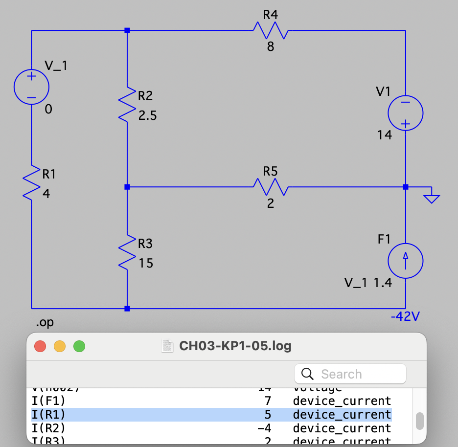 注：KiCAD 9.0 及之前的版本没有集成电流控制的受控源；电压源 V_1 的电压值设为 0 V，该电压源是用来获得控制电流的，具体见 LTspice 的帮助文件。 |
| Math      | 数学计算文件见 Github `math/ch03/CH03_KP1_05.m`              |

解析：

> 设回路电流 $I_1$ 、$I_2$ 和 $I_3$ ，参考方向如图所示。
>
> 
>
> 用网孔分析法列出电路方程
>$$
> \begin{cases}
> (R_1+R_2+R_3)I_1-R_2I_2-R_3I_3=0 \\
> -R_2I_1+(R_2+R_4+R_5)I_2-R_5I_3=-14 \\
> I_3=1.4I_1
> \end{cases}
> $$
> 将元件参数代入上述方程，得：
> $$
> \begin{cases}
> 21.5I_1-2.5I_2-15I_3=0 \\
> -2.5I_1+12.5I_2-2I_3=-14 \\
> I_3=1.4I_1
> \end{cases}
> $$
> 求解方程组，得：$I_1=5A,I_2=1A,I_3=7A$ 
> 
> 故而 $V_o=R_3(I_1-I_3)+R_5(I_2-I_3)=15×(5-7)+2×(1-7)=-42V$ 
>
> 

**`CH03-KP1-06`**: 用网孔电流法求如下图所示电路中的电压 $v$。

| 参考答案  | 4.5 V                                                        |
| --------- | ------------------------------------------------------------ |
| SPICE仿真 | 仿真文件见 Github `spice/ch03/CH03-KP1-06.asc` 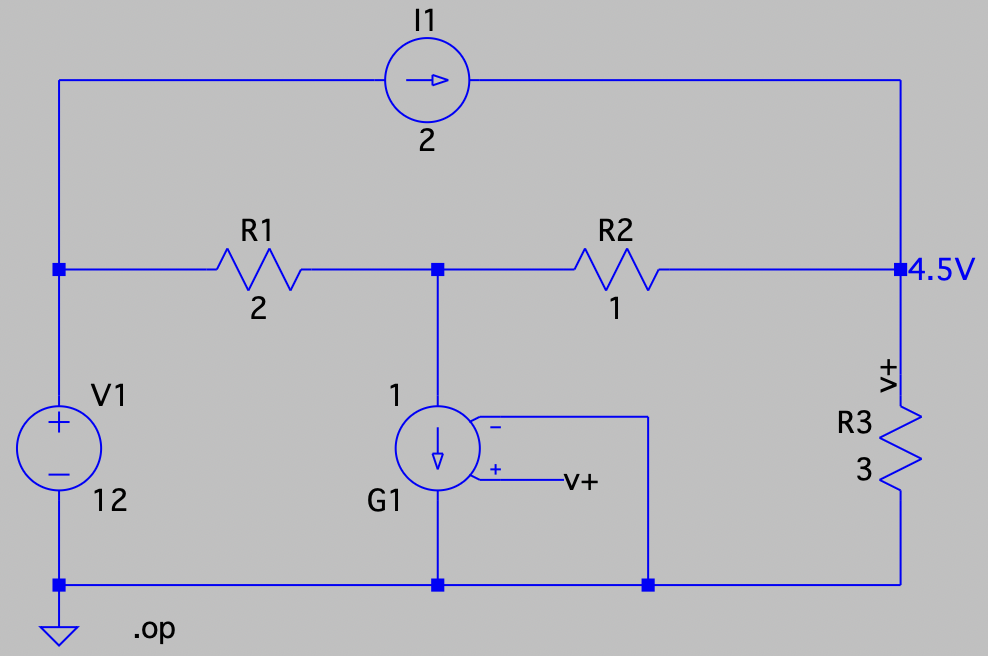 |
| Math      | 数学计算文件见 Github `math/ch03/CH03_KP1_06.m`              |

解析：

> 网孔电流都取顺时针方向，设受控电流源（电压控制电流源）的电压为 $v_x$ ，参考极性上正下负.
>
> 
>
> 则根据网孔法有：
>$$
> \begin{cases}
> 2(i_{1}-i_3)+v_x-12=0 \\
> -v_x+(1+3)i_2-1×i_3=0 \\
> i_3=2
> \end{cases}
> $$
> 因受控电流源引入附加方程为 $i_1-i_2=v$ 
> 
> 因受控源控制量 $v$ 引入的附加方程为 $v=3i_2$ 
>
> 联立解得：$\begin{cases} i_1=6A \\ i_2=1.5A \\ i_3 = 2A \end{cases}$ 	因此，$v=3i_2=4.5V$ 
>
> 

**`CH01-KP1-07`**: 使用网孔电流法求解下图中 $i_1$、$i_2$、$i_3$。

| 参考答案  | $i_1 = 4.63\,\rm{A}$; $i_2 = 0.63\,\rm{A}$; $i_3 = 1.47\,\rm{A}$ |
| --------- | ------------------------------------------------------------ |
| SPICE仿真 | 仿真文件见 Github `spice/ch03/CH03-KP1-07.asc` 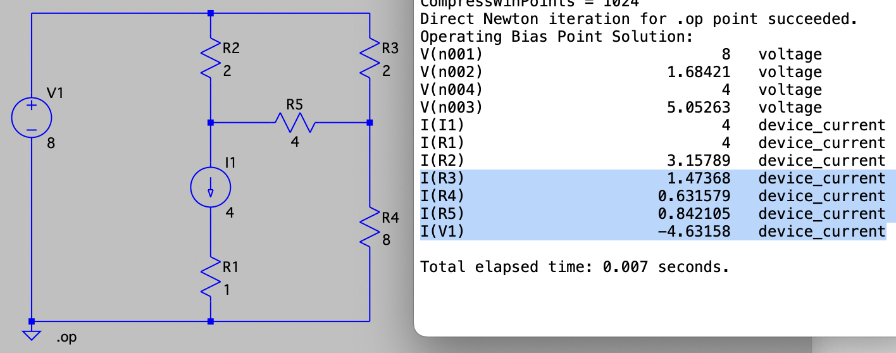 |
| Math      | 数学计算文件见 Github `math/ch03/CH03_KP1_07.m`              |

解析：

> 考虑到独立电流源的存在，将 $i_1$ 和 $i_2$ 所在的网孔并作一个 $supermesh$ 看待。
>
> 列网孔电流方程如下：
>
> $\begin{cases}	-8 +2(i_1-i_3)+4(i_2-i_3) + 8i_2 = 0 \\ 2(i_3-i_1)+2i_3+4(i_3-i_2)=0 \\ 	\end{cases}$ 
>
> 增补方程 $i_1-i_2=4$ 
>
> 联立解得：
>
> $i_1=\frac{88}{19}{\rm A},i_2=\frac{12}{19}{\rm A},i_3=\frac{28}{19}{\rm A}$ 
>
> 

**`CH03-KP1-08`**: 列出图示电路的网孔电流方程,并求 $I$。

| 参考答案  | 0.49 A                                                       |
| --------- | ------------------------------------------------------------ |
| SPICE仿真 | 仿真文件见 Github `spice/ch03/CH03-KP1-08.asc` 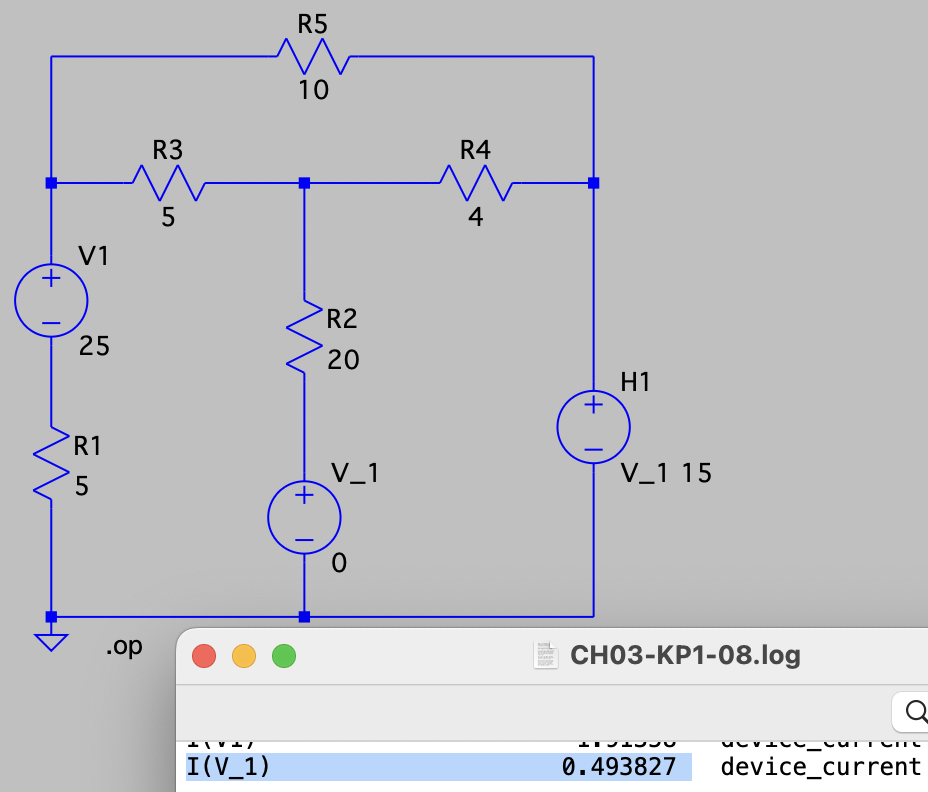 |
| Math      | 数学计算文件见 Github `math/ch03/CH03_KP1_08.m`              |

解析：

> 设左、右、上方的三个网孔的电流依次为 ${I_1}$、${I_2}$、${I_3}$，方向为顺时针。
>
> 列网孔电流方程如下
>
> $\begin{cases}	5I_1-25+5(I_1-I_3)+20(I_1-I_2)=0 \\ 20(I_2-I_1)+4(I_2-I_3)+15I=0 \\ 5(I_3-I_1)+10I_3+4(I_3-I_2)=0 	\end{cases}$ 
>
> 其中，$I=I_1-I_2$ 
>
> 解得：$I=\frac{40}{81},I_1=\frac{155}{81},I_2=\frac{115}{81},I_3=\frac{65}{81}$ 
>
> 

**`CH03-KP1-09`**: 用网孔电流法，求$I_o$

| 参考答案  | $-4\,\rm{A}$                                                 |
| --------- | ------------------------------------------------------------ |
| SPICE仿真 | 仿真文件见 Github `spice/ch03/CH03-KP1-09.asc` 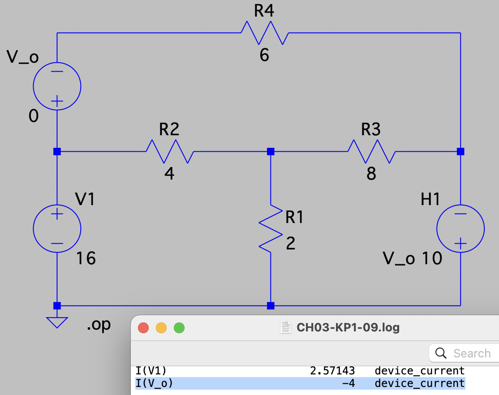 |
| Math      | 数学计算文件见 Github `math/ch03/CH03_KP1_09.m`              |

解析：

> 

**`CH03-KP1-10`**: 求图中的三个网孔电流

| 参考答案  | $i_1 = 4.8\,\rm{A}$; $i_2 = 0.8\,\rm{A}$; $i_3 = 1.6\,\rm{A}$ |
| --------- | ------------------------------------------------------------ |
| SPICE仿真 | 仿真文件见 Github `spice/ch03/CH03-KP1-10.asc` 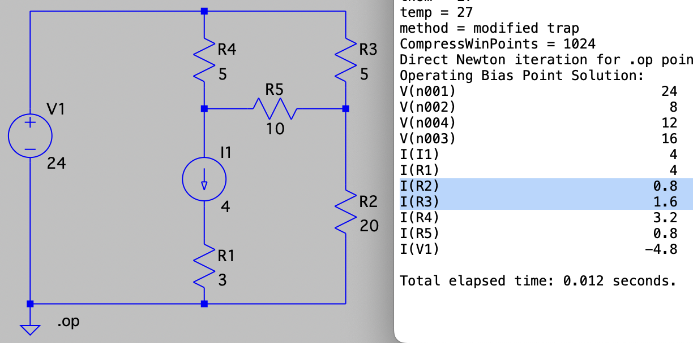 |
| Math      | 数学计算文件见 Github `math/ch03/CH03_KP1_10.m`              |

解析：

> 

**`CH03-KP1-11`**: 用网孔电流法，求下图中的 $i_o$

| 参考答案  | $-1.73\,\rm{A}$                                              |
| --------- | ------------------------------------------------------------ |
| SPICE仿真 | 仿真文件见 Github `spice/ch03/CH03-KP1-11.asc` 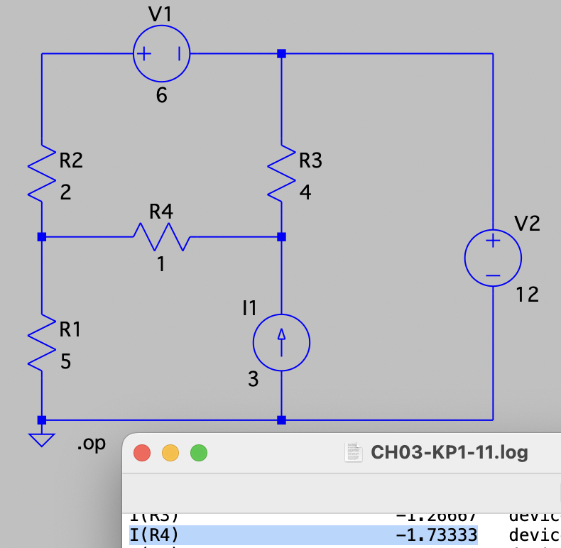 |
| Math      | 数学计算文件见 Github `math/ch03/CH03_KP1_11.m`              |

解析：

> 

**`CH03-KP1-12`**: 用网孔电流法求下图所示电路中的支路电流 $i_a \sim i_e$ 。

| 参考答案  | $i_a = 5.7\,\rm{A}$; $i_b = 4.6\,\rm{A}$; $i_c = 0.97\,\rm{A}$; $i_d = -1.1\,\rm{A}$; $i_e = 3.63\,\rm{A}$ |
| --------- | ------------------------------------------------------------ |
| SPICE仿真 | 仿真文件见 Github `spice/ch03/CH03-KP1-12.asc` 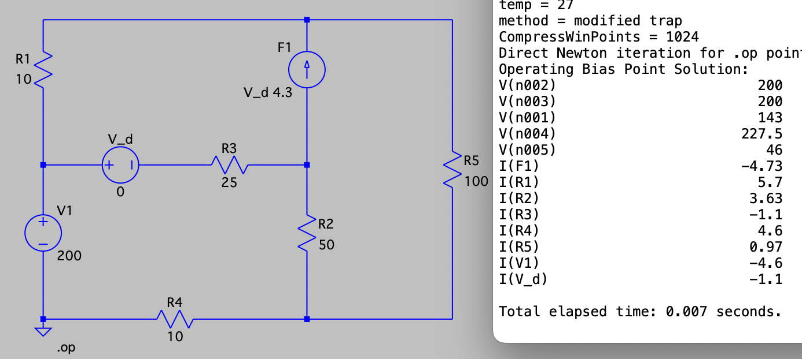 |
| Math      | 数学计算文件见 Github `math/ch03/CH03_KP1_12.m`              |

解析：

> 
>
> 去掉受控电流源，构成 supermesh：
>
> ​        $200=85i_1-25i_2-50i_3$ 
>
> ​		$0=-75i_1+35i_2+150i_3$ 		(supermesh)
>
> ​		$i_3-i_2=4.3(i_1-i_2)$ 
>
> 解得：$i_1=4.6{\rm A}$；	$i_2=5.7{\rm A}$；	$i_3=0.97{\rm A}$ 
>
> ​		$i_a=i_2=5.7{\rm A}$；		$i_b=i_1=4.6{\rm A}$；		$i_c=i_3=0.97{\rm A}$ 
>
> ​		$i_d=i_1-i_2=-1.1{\rm A}$；		$i_e=i_1-i_3=3.63{\rm A}$ 
>

**`CH03-KP1-13`**: 用网孔电流法求下图所示电路中流过电阻*R*的电流 *I*。

| 参考答案  | 2.45 mA                                                      |
| --------- | ------------------------------------------------------------ |
| SPICE模型 | 仿真文件见 Github `spice/ch03/CH03-KP1-13.asc` 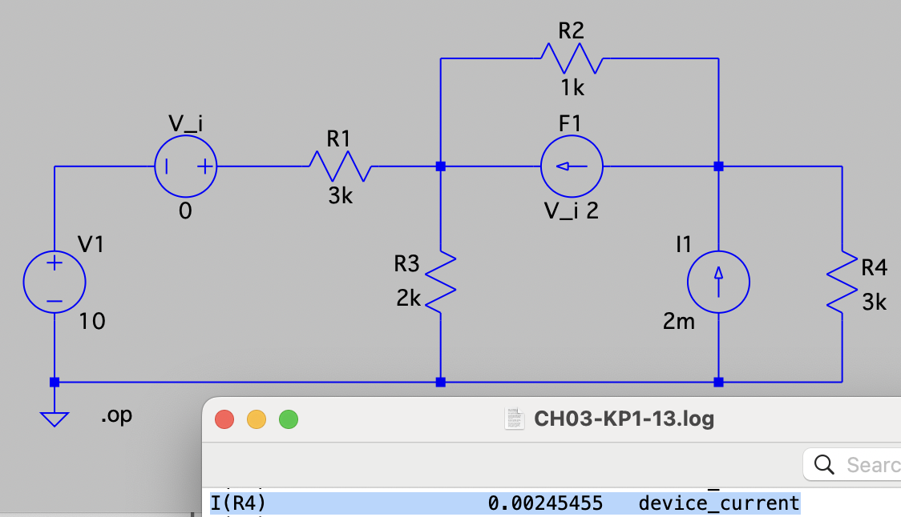 |
| Math      | 数学计算文件见 Github `math/ch03/CH03_KP1_13.m`              |

解析：

> 将受控电流源转换为受控电压源（注意下图中电压源为中文教材符号体系，与英文教材不同）。设从左到右3个网孔的电流分别为 $I_1$、$I_2$、$I_3$，电流参考方向均为顺时针方向。
>
> 
> 右侧两个 mesh 构成 supermesh，列方程
> 
> $$
> \begin{cases}
> -10 + 5 I_1 - 2 I_2 = 0\\
> -2 I_1 + 3 I_2 + 2 (-I_1) + 3 I_3 = 0\\
> I_3 - I_2 = 2
> \end{cases}
> $$
> 
> 得
> 
> $$
> \begin{cases}
> I_1 = 2.1818\\
> I_2 = 0.4545\\
> I_3 = 2.4545
> \end{cases}
> $$
> 
>$I = I_3 = 2.45\,\rm{mA}$

## 知识点2：节点电压法

**`CH03-KP2-01`**: 用节点电压法求下图所示电路中的电压 *U* 。

| 参考答案  | 32 V                                                         |
| --------- | ------------------------------------------------------------ |
| SPICE仿真 | 仿真文件见 Github `spice/ch03/CH03-KP2-01.asc` 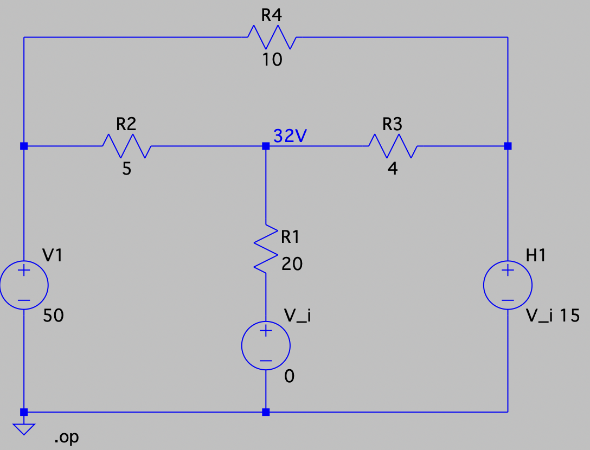 |

解析：

> 标记结点 ④ 为最下方结点
>
> 

**`CH03-KP2-02`**: 用节点电压法求解下图中的电流 $I_0$ 及电压 $V_1,V_2,V_3$ 。

| 参考答案  | $I_o = 0.36\,\rm{A}$; $V_1 = 10\, \rm{V}$; $V_2 = 10\,\rm{V}$; $V_3 = 8.57\,\rm{V}$ |
| --------- | ------------------------------------------------------------ |
| SPICE仿真 | 仿真文件见 Github `spice/ch03/CH03-KP2-02.asc` 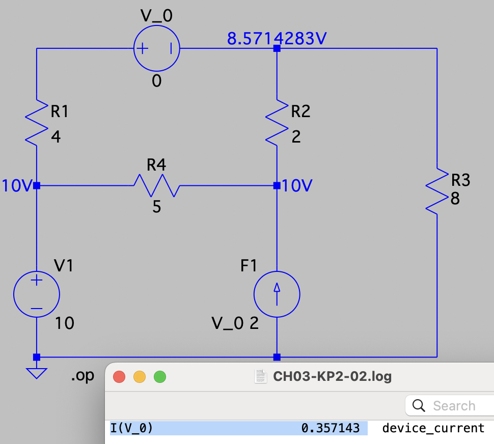 |
| Math      | 数学计算文件见 Github `math/ch03/CH03_KP2_02.m`              |

解析：

> 列节点电压方程如下：
>$$
> \begin{cases}
> V_1=10 \\
> (V_2-V_1)/5+(V_2-V3)/2-2I_0=0 \\
> -I_0+(V_3-V_2)/2+V_3/8=0
> \end{cases}
> $$
> 增补方程 $I_0=(V_1-V_3)/4$ 
> 
> 解得： $V_1=10\,\rm{V}, V_2=10\,\rm{V}, V_3=\dfrac{60}{7}\,\rm{V}, I_0=\dfrac{5}{14}\,\rm{A}$ 
>
> 

**`CH03-KP2-03`**: 求以下无源单口网络的输入电阻 $R_i$ 。已知 $R_1$ = $R_2$ = $R_3$ = $R_4$ = $R_5$ = 3Ω，$R_6$ = 1Ω。

| 参考答案  | 1.5 Ω                                                        |
| --------- | ------------------------------------------------------------ |
| SPICE仿真 | 仿真文件见 Github `spice/ch03/CH03-KP2-03.asc` 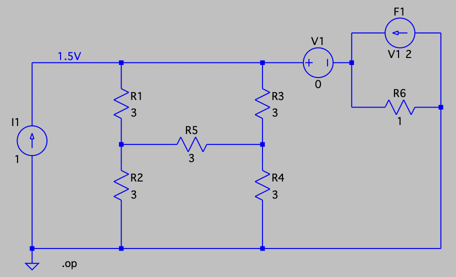 |
| Math      | 数学计算文件见 Github `math/ch03/CH03_KP2_03.m`              |

解析：

> **方法1：**
>
> 选取参考地，并对图中的节点电压进行标记如下：
>
> 
>
> 列节点电压方程如下：
>$$
> \begin{cases}
> V_1/R_2+(V_1-V_2)/R_5+(V_1-V_3)/R_1=0 \\
> V_2/R_4+(V_2-V_1)/R_5+(V_2-V_3)/R_3=0 \\
> V_3=3I×R_6 
> \end{cases}
> $$
> 为简化计算过程，可取 $I=1 A$ 
> 
> 计算得到： $V_1=V_2=\frac{3}{2}V,V_3=3V,I_{in}=I+V_1/R_2+V_2/R_4=2A$ 
>
> 故而输入电阻 $R_i=\frac{U}{I_{in}}=\frac{V_3}{I_{in}}=\frac{3}{2}Ω$ 
>
> 
>
> **方法2：**
>
> 左边电路用Y-$\Delta$ 化简，等效为 3 Ω 电阻（比如 R1、R2、R5 的 Y 网络转换为阻值 9 Ω 的 $\Delta$ 网络，再进一步串并联化简，可得到R1～R5 5个电阻的网络可化简为等效电阻 3 Ω）；右边电路令 $I = 1A$, 电压 = 3 V，即右边等效为 3 Ω，故整体等效电阻为 1.5 Ω。

**`CH03-KP2-04`**、使用节点电压法求解下图中的 $v_1$ 、$v_2$ 和 $v_3$ 。

| 参考答案  | $v_1 = 7.61\,\rm{V}$; $v_2 = -17.39\,\rm{V}$; $v_3 = 1.63\,\rm{V}$ |
| --------- | ------------------------------------------------------------ |
| SPICE仿真 | 仿真文件见 Github `spice/ch03/CH03-KP2-04.asc` 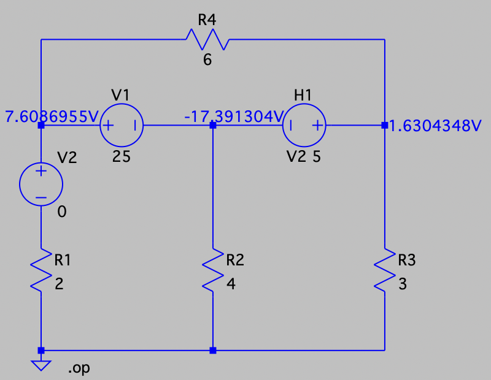 |
| Math      | 数学计算文件见 Github `math/ch03/CH03_KP2_04.m`              |

解析：

> 把上方三个元件看成一个 supernode，
>
> 列节点电压方程如下：
> $$
> \begin{cases}
> \frac{1}{2}V_1+\frac{1}{4}V_2+\frac{1}{3}V_3=0 \\
> V_1-V_2=25 \\
> V_3-V_2=5×\frac{1}{2}V_1
> \end{cases}
> $$
> 解得： $V_1=7.61V,V_2=-17.39V,V_3=1.63V$ 
>
> 

**`CH03-KP2-05`**: 列写图示电路的节点电压方程。

> 解：
>
> 标记节点①~④如下图所示：
>
> 
>
> 列节点电压方程如下：
> $$
> \begin{cases}
> V_1=14 \\
> (\frac{1}{2}+\frac{1}{3}+\frac{1}{5})V_2-\frac{1}{2}V_1-\frac{1}{3}V_3=0 \\
> (\frac{1}{3}+\frac{1}{4})V_3-\frac{1}{4}V_1-\frac{1}{3}V_2=-\frac{12}{4}-5I_1
> \end{cases}
> $$
> 增补方程 $I_1=\frac{V_1-V_3-12}{4}$ 

**`CH03-KP2-06`**: 用节点电压法分析如下电路，列出足够求解的方程。

> 解：
>
> 列三个节点方程如下：
> $$
> \begin{cases}
> (\frac{1}{R_1}+\frac{1}{R_2})U_1 - \frac{1}{R_2}U_2 = I_s \\
> -\frac{1}{R_2}U_1 + (\frac{1}{R_2}+\frac{1}{R_3})U_2 = g_mU_{R_2} \\
> \frac{1}{R_4}U_3 = -g_mU_{R_2}
> \end{cases}
> $$
> 另需要一个补充方程
> $$
> U_{R_2} = U_1 - U_2
> $$

**`CH03-KP2-07`**: 用节点电压法求下图所示电路的节点电压 $V_{na}、V_{nb}、V_{nc}和i_x$ 。

| 参考答案  | $V_{na} = 135\,\rm{V}$; $V_{nb} = 108\,\rm{V}$; $V_{nc} = 126\,\rm{V}$; $i_x = 0.3\,\rm{A}$ |
| --------- | ------------------------------------------------------------ |
| SPICE仿真 | 仿真文件见 Github `spice/ch03/CH03-KP2-07.asc` 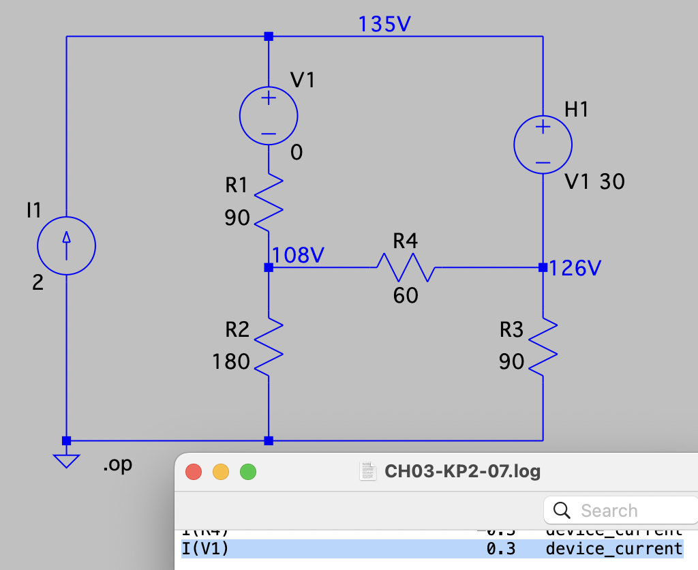 |
| Math      | 数学计算文件见 Github `math/ch03/CH03_KP2_07.m`              |

解析：

> **方法1：**
>
> 设受控电压源流出的电流为 $i$ 
>$$
> \begin{cases}
> \frac{1}{90}V_{na}-\frac{1}{90}V_{nb}=2+i \\
> -\frac{1}{90}V_{na}+(\frac{1}{90}+\frac{1}{60}+\frac{1}{180})V_{nb}-\frac{1}{60}V_{nc}=0 \\
> -\frac{1}{60}V_{nb}+(\frac{1}{90}+\frac{1}{60})V_{nc}=-i \\
> V_{na}-V_{nc}=30i_x \\
> i_x=\frac{1}{90}(V_{na}-V_{nb})
> \end{cases}
> $$
> 解得： $V_{na}=135V,V_{nb}=108V,V_{nc}=126V,i=-1.7A,i_x=0.3A$ 
> 
> **方法2：**
>
> 把 a、c 看成一个 supernode，
> $$
> \begin{cases}
> \frac{1}{90}V_{na}-(\frac{1}{90}+\frac{1}{60})V_{nb}+(\frac{1}{90}+\frac{1}{60})V_{nc}=2 \\
> 对点b:-\frac{1}{90}V_{na}+(\frac{1}{90}+\frac{1}{60}+\frac{1}{180})V_{nb}-\frac{1}{60}V_{nc}=0 \\
> 另外,V_{na}-V_{nc}=30i_x=\frac{30}{90}(V_{na}-V_{nb})
> \end{cases}
> $$
>
> $$
> ⇒
> \begin{cases}
> 2V_{na}-5V_{nb}+5V_{nc}=360 \\
> -2V_{na}+6V_{nb}-3V_{nc}=0 \\
> 2V_{na}+V_{nb}-3V_{nc}=0
> \end{cases}
> ⇒
> \left(
> \begin{matrix}
> 	2 & -5 & 5 \\
> 	-2 & 6 & -3 \\
> 	2 & 1 & -3
> 	\end{matrix}
> \right)
> 
> \left(
> \begin{matrix}
> 	V_{na} \\
> 	V_{nb} \\
> 	V_{nc}
> 	\end{matrix}
> \right)
> =
> \left(
> \begin{matrix}
> 	360 \\
> 	0 \\
> 	0
> 	\end{matrix}
> \right)
> $$
>
> 解得：
> $$
> \left(
> \begin{matrix}
> 	V_{na} \\
> 	V_{nb} \\
> 	V_{nc}
> 	\end{matrix}
> \right)
> =
> \left(
> \begin{matrix}
> 	135 \\
> 	108 \\
> 	126
> 	\end{matrix}
> \right)V,i_x = 0.3
> $$
> 

**`CH03-KP2-08`**: 用节点电压法求解下图所示电路中的支路电流 $I_b$ 。

| 参考答案  | 0.079 A                                                      |
| --------- | ------------------------------------------------------------ |
| SPICE模型 | 仿真文件见 Github `spice/ch03/CH03-KP2-08.asc` 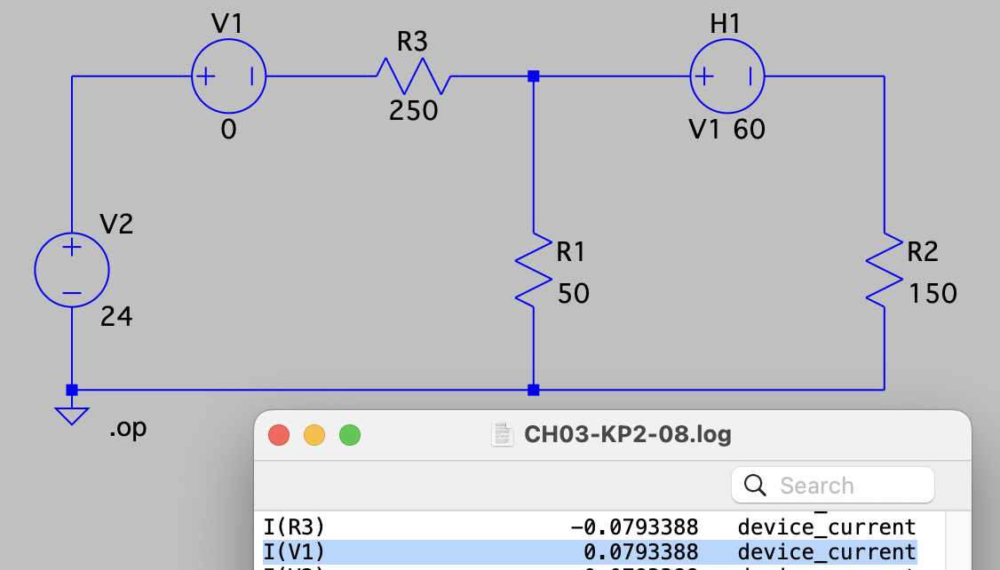 |
| Math      | 数学计算文件见 Github `math/ch03/CH03_KP2_08.m`              |

解析：

> 令中间节点电压为V，受控源构成 supernode，
>$$
> \begin{cases}
> (\frac{1}{250}+\frac{1}{50}+\frac{1}{150})V=\frac{24}{250}+\frac{60I_b}{150} \\
> I_b=\frac{24-V}{250}
> \end{cases}
> $$
> 解得： $I_b=\frac{48}{605}≈0.079A$ 
> 
> 

**`CH03-KP2-09`**: 用节点电压法求以下电路中各节点的电压。

| 参考答案  | 令下方节点为参考地，则上方四个节点从左到右电压分别为 16.3 V、$-7.69\,\rm{V}$、 1.23 V、0.31 V |
| --------- | ------------------------------------------------------------ |
| SPICE仿真 | 仿真文件见 Github `spice/ch03/CH03-KP2-09.asc` 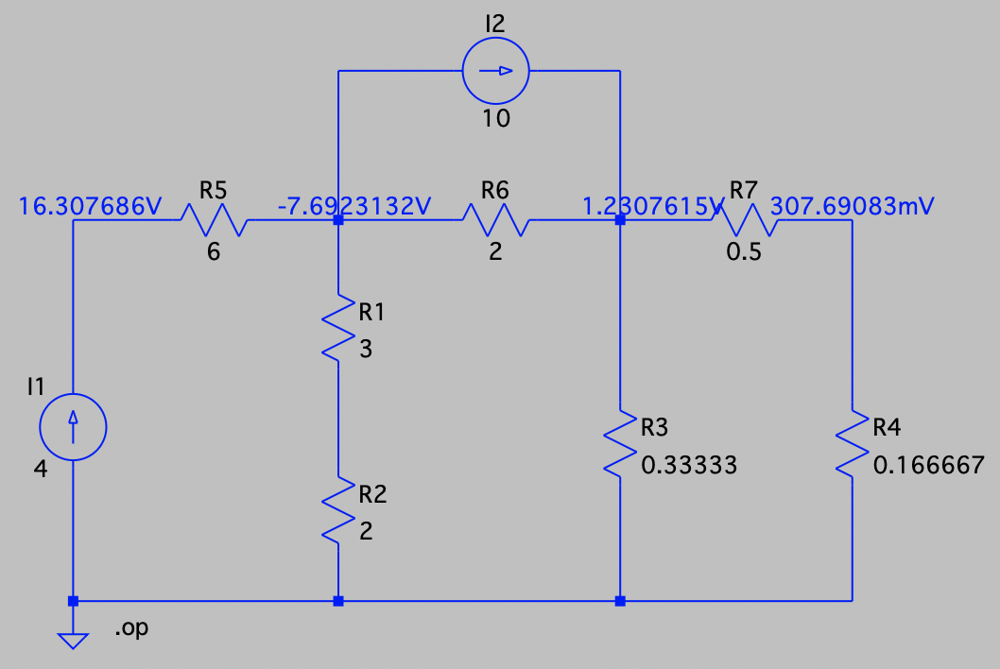 |
| Math      | 数学计算文件见 Github `math/ch03/CH03_KP2_09.m`              |

解析：

> 10 A 电流源左右节点电压分别记为 $v_{n1}$ 和 $v_{n2}$，最下方节点记为参考地，则有
>$$
> \begin{cases}
> (\frac{1}{2}+\frac{1}{3+2})v_{n1}-\frac{1}{2}v_{n2}=4-10 \\
> -\frac{1}{2}v_{n1}+(\frac{1}{2}+3+\frac{2×6}{2+6})v_{n2}=10
> \end{cases}
> $$
> 整理后，得到：
> $$
> \begin{cases}
> 0.7v_{n1}-0.5v_{n2}=-6 \\
> -0.5v_{n1}+5v_{n2}=10
> \end{cases}
> $$
> 解得：
> $$
> \begin{cases}
> v_{n1}≈-7.69V \\
> v_{n2}≈1.23V
> \end{cases}
> $$
> 

**`CH03-KP2-10`**: 用节点电压法求下图所示电路中电流源两端的电压 *v* 。

| 参考答案  | 19.6 V                                                       |
| --------- | ------------------------------------------------------------ |
| SPICE仿真 | 仿真文件见 Github `spice/ch03/CH03-KP2-10.asc` 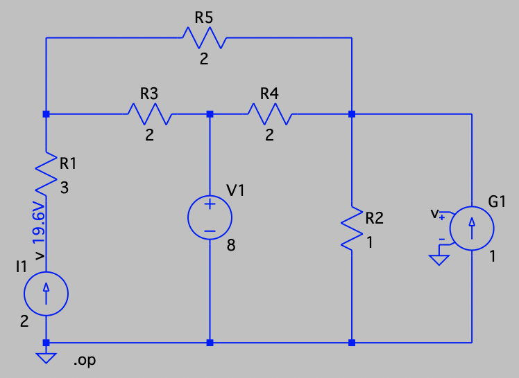 |
| Math      | 数学计算文件见 Github `math/ch03/CH03_KP2_10.m`              |

解析：

> 以底端节点作为参考节点，上端三个节点的节点电压分别为 $v_{n1}$ 、 $v_{n2}$ 和 $v_{n3}$ 。
>
>   因为与第一个节点相连接的 3 Ω 为多余电阻，则有：
>$$
>   \begin{cases}
> (\frac{1}{2}+\frac{1}{2})v_{n1}-\frac{1}{2}v_{n2}-\frac{1}{2}v_{n3}=2 \\
>   v_{n2}=8 \\
>   -\frac{1}{2}v_{n1}-\frac{1}{2}v_{n2}+(\frac{1}{2}+\frac{1}{2}+\frac{1}{1})v_{n3}=v
>   \end{cases}
>   $$
>   因受控源引入的附加方程为：
> $$
>   v_{n1}=v-2×3
> $$
>   解得：$\begin{cases} v_{n1}=13.6V \\ v_{n2}=8V \\ v_{n3}=15.2V \end{cases}$ 	得：$v=19.6V$ 
> 
>   

**`CH03-KP2-11`**: 列出图示电路的节点电压方程，并求 $I$。

| 参考答案  | 0.49 A                                                       |
| --------- | ------------------------------------------------------------ |
| SPICE仿真 | 仿真文件见 Github `spice/ch03/CH03-KP2-11.asc` 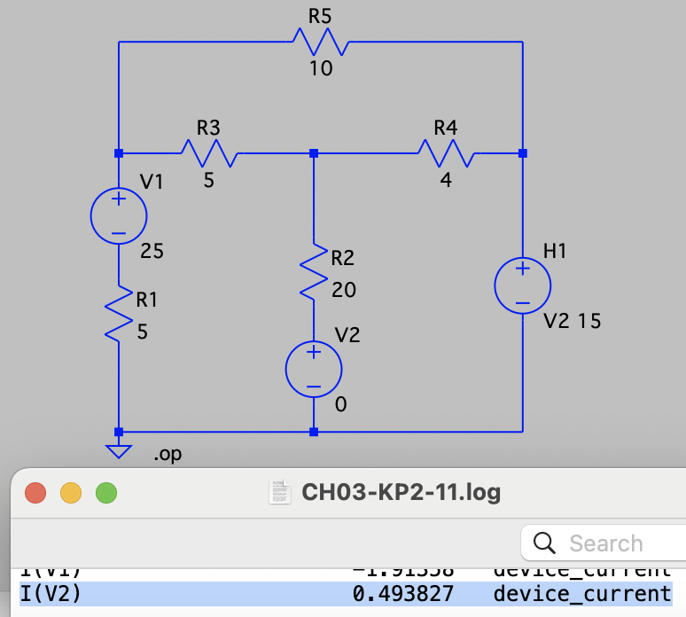 |
| Math      | 数学计算文件见 Github `math/ch03/CH03_KP2_11.m`              |

解析：

> 考虑到独立电压源的存在，将独立电压源及上方节点看做一个 $supernode$ 。记 $supernode$ 上、下方电压分别为 $v_a$ 和 $v_b$ 。
>
> 以底端节点为参考节点，$supernode$ 右侧的两个节点分别标记为 $v_1$ 和 $v_2$ 。
>
> 列节点电压方程如下：
>
> $\begin{cases}	\frac{v_a-v_2}{10}+\frac{v_a-v_1}{5}+\frac{v_b}{5}=0 \\ \frac{v_1-v_a}{5}+\frac{v_1-v_2}{4}+\frac{v_1}{20}=0 \\ v_2=15I	\end{cases}$ 
>
> 增补方程 $v_a-v_b=25$ ，$I=\frac{v_1}{20}$ 
>
> 联立解得：
>
> $v_a=\frac{1250}{81}{\rm V}$，$v_b=\frac{-775}{81}{\rm V}$，$v_1=\frac{800}{81}{\rm V}$，$v_2=\frac{600}{81}{\rm V}$，$I=\frac{40}{81}{\rm A}$ 

**`CH03-KP2-12`**: 用节点电压法，求节点1、2、3的电压值

| 参考答案  | $v_1 = 32\,\rm{V}$; $v_2 = -25.6\,\rm{V}$; $v_3 = 62.4\,\rm{V}$ |
| --------- | ------------------------------------------------------------ |
| SPICE仿真 | 仿真文件见 Github `spice/ch03/CH03-KP2-12.asc` 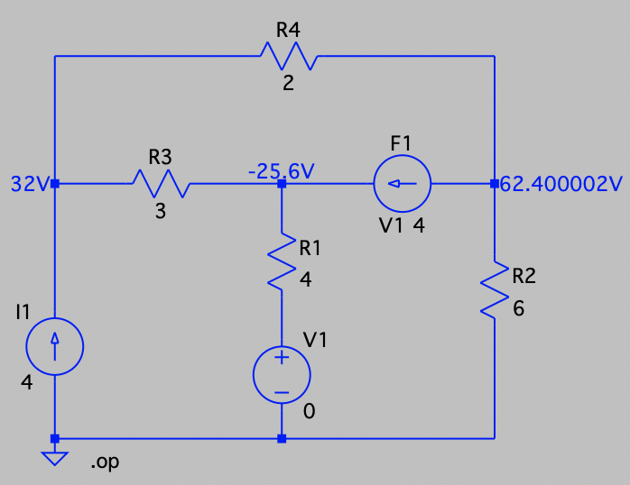 |
| Math      | 数学计算文件见 Github `math/ch03/CH03_KP2_12.m`              |

解析：

> 

**`CH03-KP2-13`**: 用节点电压法，求下图中的 $V_x$

| 参考答案  | 30 V                                                         |
| --------- | ------------------------------------------------------------ |
| SPICE仿真 | 仿真文件见 Github `spice/ch03/CH03-KP2-13.asc` 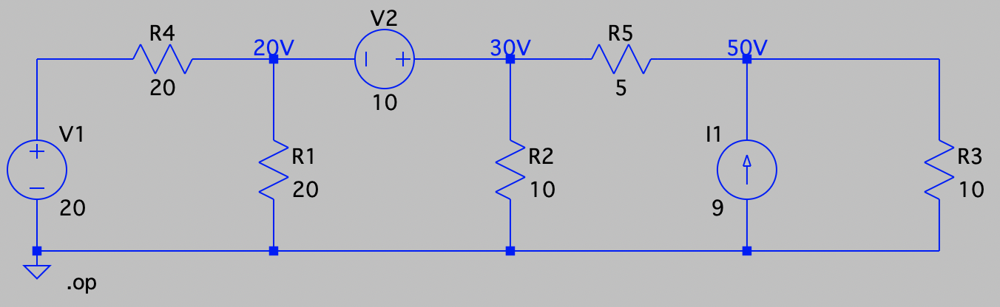 |
| Math      | 数学计算文件见 Github `math/ch03/CH03_KP2_13.m`              |

解析：

> 10 V 电压源构成 supernode， 中间三个节点分别记为 1、2、3， 列方程如下：
>
> $\frac{v_1-20}{20} + \frac{v_1-0}{20} + \frac{v_2-0}{10} + \frac{v_2-v_3}{5} = 0$
>
> $\frac{v_3-v_2}{5} - 9 +\frac{v_3-0}{10} = 0$
>
> $v_2 - v_1 = 10$
>
> 求得 $V_x = v_2 = 30$ V

**`CH03-KP2-14`**: 用节点电压法，求下图中的 $V_o$

| 参考答案  | 1.11 V                                                       |
| --------- | ------------------------------------------------------------ |
| SPICE仿真 | 仿真文件见 Github `spice/ch03/CH03-KP2-14.asc` 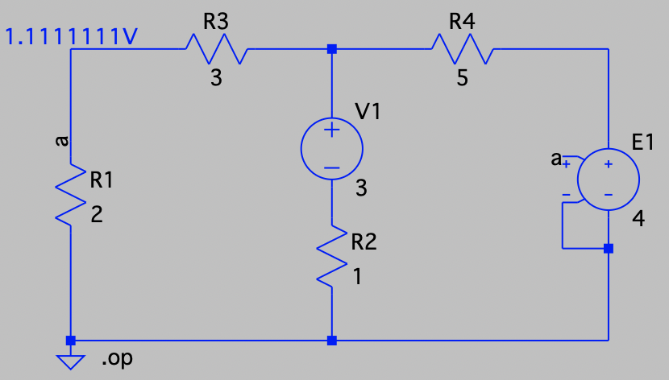 |

解析：

> 

**`CH03-KP2-15`**: 求下图所示电路的节点电压 $v_1$，$v_2$，$v_3$。

| 参考答案  | $v_1 = 156\,\rm{V}$; $v_2 = 120\,\rm{V}$; $v_3 = 78\,\rm{V}$ |
| --------- | ------------------------------------------------------------ |
| SPICE仿真 | 仿真文件见 Github `spice/ch03/CH03-KP2-15.asc` 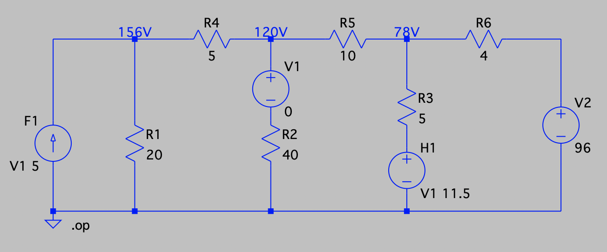 |
| Math      | 数学计算文件见 Github `math/ch03/CH03_KP2_15.m`              |

解析：

> $i_o=\frac{v_2}{40}$ 
>
> $-5i_o + \frac{v_1}{20} +\frac{v_1-v_2}{5}=0$ 		 		so	$10v_1-13v_2+0v_3=0$ 
>
> $\frac{v_2-v_1}{5}+\frac{v_2}{40}+\frac{v_2-v_3}{10}=0$ 				so	$-8v_1+13v_2-4v_3=0$ 
>
> $\frac{v_3-v_2}{10}+\frac{v_3-11.5i_o}{5}+\frac{v_3-96}{4}=0$ 	 so	$0v_1-63v_2+220v_3=9600$ 
>
> 解得：$v_1=156{\rm V}$；$v_2=120{\rm V}$；$v_3=78{\rm V}$ 

**`CH03-KP2-16`**: 用节点电压法求下图所示电路的节点1、2、3和4的电压 $V_{n1}$、$V_{n2}$、$V_{n3}$ 和 $V_{n4}$。

| 参考答案  | $V_{n1} = 0\,\rm{V}$; $V_{n2} = 126\,\rm{V}$; $V_{n3} = 135\,\rm{V}$; $V_{n4} = 108\,\rm{V}$ |
| --------- | ------------------------------------------------------------ |
| SPICE仿真 | 仿真文件见 Github `spice/ch03/CH03-KP2-16.asc` 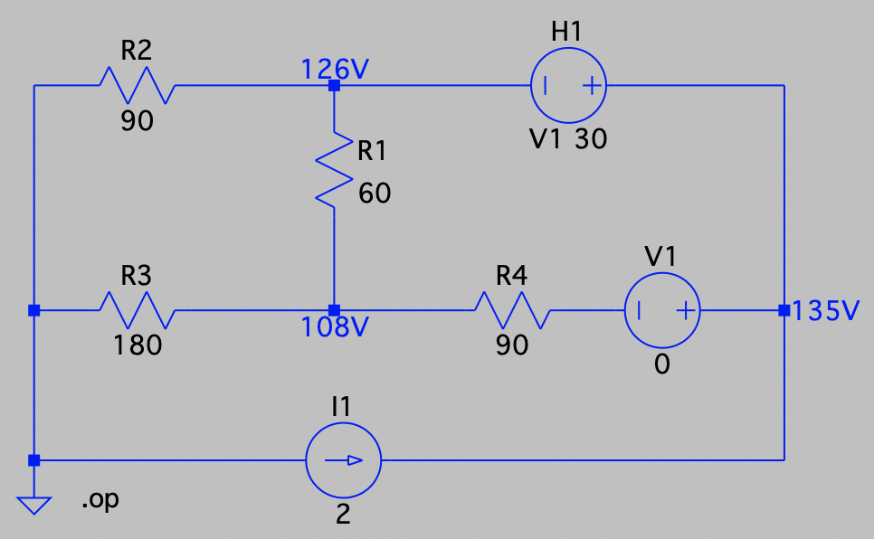 |
| Math      | 数学计算文件见 Github `math/ch03/CH03_KP2_16.m`              |

解析：

>受控电压源构成 supernode，列方程：
>$$
>\begin{cases}
>\dfrac{V_{n2}}{90} + \dfrac{V_{n2}-V_{n4}}{60} + \dfrac{V_{n3}-V_{n4}}{90} - 2 = 0 \\
>\dfrac{V_{n4}}{180} + \dfrac{V_{n4}-V_{n2}}{60} + \dfrac{V_{n4}-V_{n3}}{90} = 0 \\
>V_{n3} - V_{n2} = 30\dfrac{V_{n3}-V_{n4}}{90}
>\end{cases}
>$$
>解得：$V_{n1} = 0\,\rm{V}$; $V_{n2} = 126\,\rm{V}$; $V_{n3} = 135\,\rm{V}$; $V_{n4} = 108\,\rm{V}$

## 知识点3：叠加定理

**`CH03-KP3-01`**: 线性电路中，无法直接用叠加定理求解的物理量为 ________ 。

A. 功率	

B. 电压	

C. 电流	

| 参考答案 | A    |
| -------- | ---- |

解析：

> 功率是电压或电流的平方项关系，不符合线性性质

**`CH03-KP3-02`**: 右图所示电路中，电压U为 ________ 。

A. 4V	

B. 5V	

C. 6V	

D. 3V

| 参考答案  | C                                                            |
| --------- | ------------------------------------------------------------ |
| SPICE仿真 | 仿真文件见 Github `spice/ch03/CH03-KP3-02.asc` 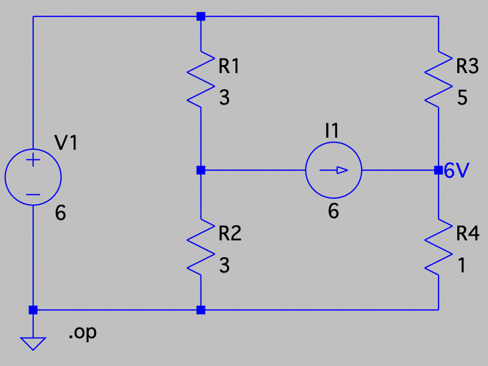 |

解析：

> 只考虑 6 V 时，电流源开路，U = 1 V；只考虑 6 A 时，5 ohm 和 1 ohm 并联，等效为 5/6 ohm，U 为 5 V，故总的 U 为 1+5 = 6 V

**`CH03-KP3-03`**: 叠加定理仅适用于 ________ 电路；在各分电路中，要把不作用的独立电源置零。不作用的独立电压源用 ________ 代替，不作用的独立电流源用 ________ 代替。

| 参考答案 | 线性；短路；开路 |
| -------- | ---------------- |

解析：

> turn off 对于独立电压源而言是短路（设电压 = 0），对于独立电流源而言是开路（设电流 = 0）

**`CH03-KP3-04`**: 叠加定理适用于 ________ 。

A. 线性电路		

B. 非线性电路		

C. 线性或非线性电路		

D. 无受控源的电路

| 参考答案 | A    |
| -------- | ---- |

解析：

> 叠加性的前提是线性

**`CH03-KP3-05`**: 使用叠加原理计算下图所示电路中的电流 $I$。

| 参考答案  | $\dfrac{3}{8}\,\rm{A}$                                       |
| --------- | ------------------------------------------------------------ |
| SPICE仿真 | 仿真文件见 Github `spice/ch03/CH03-KP3-05.asc` 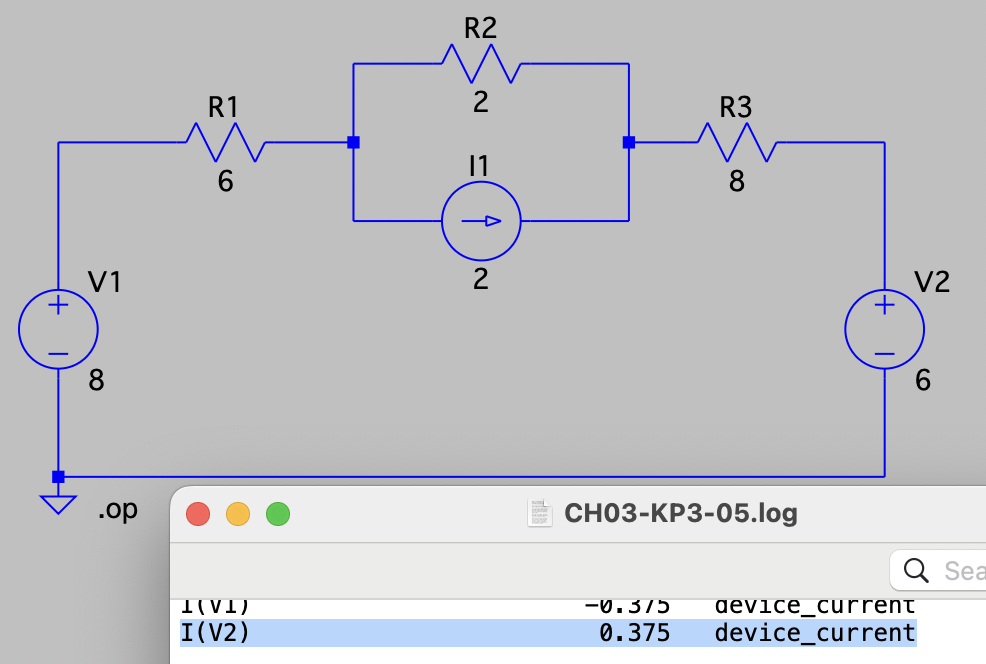 |

解析：

> (1) 保留 8 V 的电压源，turn off 2 A 的电流源和 6 V 的电压源
>
> ​	  $I_1=\frac{8}{16}=\frac{1}{2}A$ 
>
> (2) 保留 6 V 的电压源，turn off 2 A 的电流源和 8 V 的电压源
>
> ​	  $I_2=-\frac{6}{16}=-\frac{3}{8}A$ 
>
> (3) 保留 2 A 的电流源，turn off 6 V 的电压源和 8 V 的电压源
>
> ​	  $I_3=2×\frac{2}{14+2}=\frac{1}{4}A$ 
>
> 故，  $I = I_1 + I_2 + I_3 = \frac{3}{8}A$ 

**`CH03-KP3-06`**: 用叠加定理求下图所示电路中电流源两端的电压 *U*。

| 参考答案  | 8.4 V                                                        |
| --------- | ------------------------------------------------------------ |
| SPICE仿真 | 仿真文件见 Github `spice/ch03/CH03-KP3-06.asc` 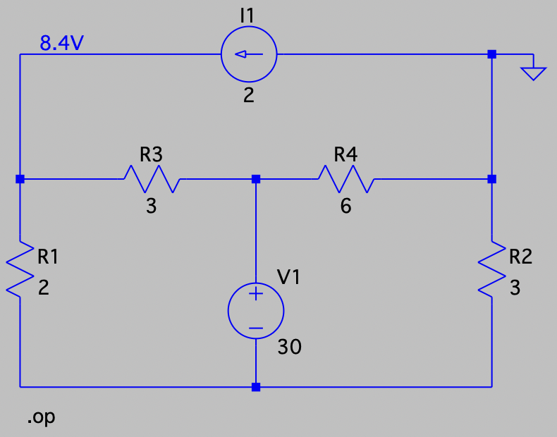 |

解析：

> (1) 保留 2 A 的电流源，turn off 30 V 的电压源
>
> ​	  $R_{eq}=2Ω||3Ω+3Ω||6Ω=\frac{2×3}{2+3}+\frac{3×6}{3+6}=3.2Ω$ 
>
> ​	  $U_1=R_{eq}×2A=6.4V$ 
>
> (2) 保留 30 V 的电压源，turn off 2 A 的电流源
>
> ​	  $U_2=(30-30×\frac{3}{3+2})-(30-30×\frac{6}{6+3})=12V-10V=2V$ 
>
> 故，$U=U_1+U_2=8.4V$ 

**`CH03-KP3-07`**: 用叠加定理，求下图中的 $v_o$

| 参考答案  | 8 V                                                          |
| --------- | ------------------------------------------------------------ |
| SPICE仿真 | 仿真文件见 Github `spice/ch03/CH03-KP3-07.asc` 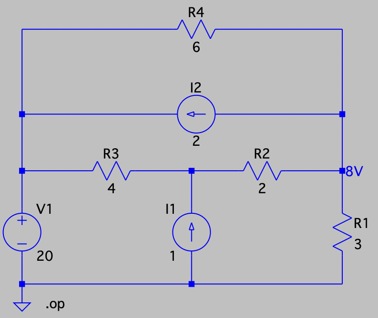 |

解析：

> 
>
> 

**`CH03-KP3-08`**: 采用电源变换和叠加原理，求下列电路中的 $i_o$

| 参考答案  | 1.78 A                                                       |
| --------- | ------------------------------------------------------------ |
| SPICE仿真 | 仿真文件见 Github `spice/ch03/CH03-KP3-08.asc` 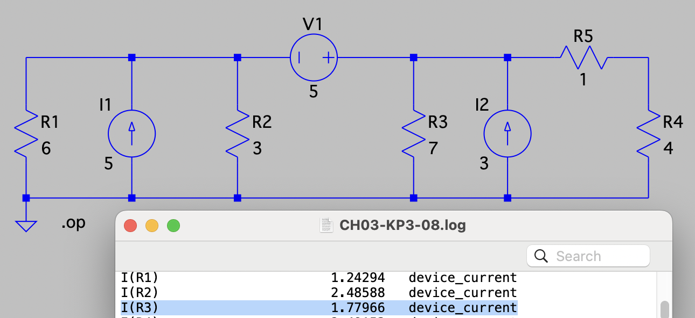 |

解析：

> 

**`CH03-KP3-09`**: 如下图所示电路，求：

(1) 电压 *V*；

(2) 电压源和受控源上的功率。

| 参考答案  | (1) 3 V； (2) 电压源提供功率 100 W，受控源消耗功率 72 W      |
| --------- | ------------------------------------------------------------ |
| SPICE仿真 | 仿真文件见 Github `spice/ch03/CH03-KP3-09.asc` 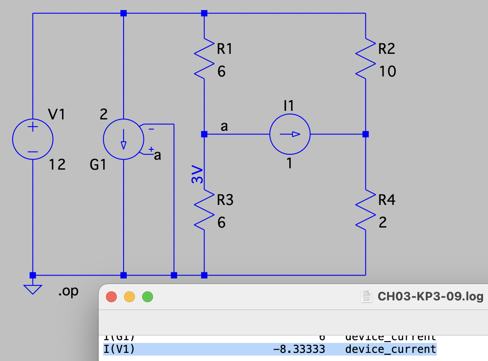 |

解析：

> (1) 受控源并联在电压源两端，不会对电路产生影响，可以忽略。使用叠加定理计算电压*V*：
>
> 当电流源开路，电压为两个 6 欧电阻分压，6 V;
>
> 当电压源短路，电路如下，电压为 1 A 电流源流过两个 6 欧电阻并联，$-3\,\rm{V}$;
>
> 
>
> 故 *V* = 6 – 3 = 3 V
>
> (2) 受控源上的电流是 6 A，电压 $-12\,\rm{V}$（对于电流源，电流指向端为电压正端），故消耗功率 72 W。
>
> 左上 6 欧电阻的电流是 3/6+1 = 1.5 A，
>
> 设通过右上10欧电阻的电流是 *i*，参考方向向下，则
>
> 10*i*+2(*i*+1)=12，得
>
> *i* = 5/6 A，
>
> 故电压源出来的电流是 6+1.5+5/6 = 25/3 A，
>
> 输出功率 $P_S = 12 \times \frac{25}{3} = 100\,\rm{W}$

## 知识点4：戴维南定理

**`CH03-KP4-01`**: 用戴维南定理求 $V$ 。

| 参考答案  | 2.5 V                                                        |
| --------- | ------------------------------------------------------------ |
| SPICE仿真 | 仿真文件见 Github `spice/ch03/CH03-KP4-01.asc` 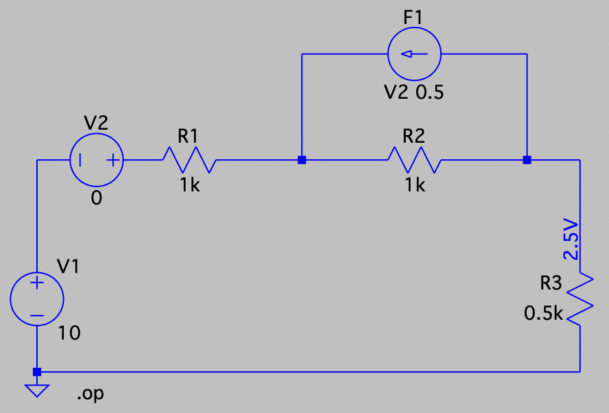 |

解析：

> (1) 求开路电压：a、b 开路， $I=0,V_{oc}=10\,\rm{V}$ 
>
> (2) turn off 独立源，求 $R_o$ ：
>
> 方法一：加压求流法
>
> 
>
> 得到： $V_o=(I_o-0.5I_o)×10^3+I_o×10^3=1500I_o$ 
>
> 故而	$R_o=V_o/I_o=1.5kΩ$ 
>
> 方法二：端口电流 $I$，端口电压 = $I\cdot 1\rm{k}+0.5I\cdot 1\rm{k} = 1.5\rm{k}\cdot I$，所以戴维南电阻为 1.5 kΩ
>
> (3) 等效电路：
>
> 将 $R_0=1.5\,\rm{kΩ},V_{oc}=10\,\rm{V}$ 代入右侧的等效电路图中，
>
> 得到： $V=V_{oc}×500/(1500+500)=2.5\,\rm{V}$ 

**`CH03-KP4-02`**: 下图所示电路的戴维南等效电路是 ________ 。

A. 	

B. 	

C. 	

D. 

| 参考答案 | A    |
| -------- | ---- |

解析：

> 等效电阻：电压源短路，电流源开路，所以是 5 ohm；开路电压：利用叠加定理，先考虑 2 V，得到 2 V，再考虑电流源 0.5 A，得到 -2 V，再考虑 1A，得到5V，所以总计2-2+5 = 5V；故为 A

**`CH03-KP4-03`**:将下图 (a) 电路等效为图 (b) 电路，可求得输出端短路电流 $I$ = ________ 。

| 参考答案 | $-0.5\,\rm{A}$ |
| -------- | -------------- |

解析：

> **方法一：**
>
> 开路电压：记中间节点为 1，列节点电压方程：$\dfrac{2-V_1}{1} = \dfrac{V_1}{2}$，得到 $V_1 = \dfrac{4}{3}\,\rm{V}$；$V_{oc} = V_1 + 3V_{oc}\cdot 2$，得到
>
> $V_{oc} = \dfrac{-4}{15}\,\rm{V}$，
>
> 等效电阻：$V = I\cdot\dfrac{2}{3}+(3V+I)\cdot 2$，得到
>
> $\dfrac{V}{I}=\dfrac{-8}{15}\ohm$， 
>
> 故，短路电流为 $-0.5\,\rm{A}$
>
> 方法二：
>
> 输出短路，及 V=0，所以受控源开路，所求电流为 2 Ω 上的分流电流，而总电流为 1 A，所以输出短路电流为 $-0.5\,\rm{A}$。

**`CH03-KP4-04`**: 求下图所示电路的戴维南等效电路。

解析：

> (1) 首先求开路电压 $v_{OC}$ 。采用节点分析法来求解。
>
> 
>
> 
>$$
>\begin{cases}
> (\frac{1}{1}+\frac{1}{2})v_{OC}-\frac{1}{1}×v_{n2}-\frac{1}{2}×v_{n3}=\frac{3}{4}v_{OC} \\
> -(\frac{1}{1}+\frac{1}{2})v_{OC}+(\frac{1}{1}+\frac{1}{1})v_{n2}+(\frac{1}{1}+\frac{1}{2})v_{n3}=0 \\
> v_{n2}-v_{n3}=1
> \end{cases}
> $$
> 解得： $v_{OC}=\frac{4}{3}V≈1.33V$ 
> 
> 
>
> (2) 然后求等效电阻 $R_o$ 
>
> ​	 在端口施加一电压 $v$ ，独立电压源短路，与受控电流源串联的电阻可以视为短路，得到：
>
> 
>
> ​	  则 $i=0.75v+\frac{-v}{1Ω||2Ω+1Ω||1Ω}=0.75v+\frac{-v}{\frac{2}{3}+\frac{1}{2}}⇒v=-\frac{28}{3}i$ 
>
> ​		 $R_o=-\frac{v}{i}=\frac{28}{3}Ω≈9.33Ω$ 
>
> ​	  因此，原电路的戴维南等效电路如下所示：
>
> 

**`CH03-KP4-05`**: 如下图所示电路，当 $R_x=20\,\Omega$ 时，求电流 $I_x$ 。

| 参考答案  | 0.25 A                                                       |
| --------- | ------------------------------------------------------------ |
| SPICE仿真 | 仿真文件见 Github `spice/ch03/CH03-KP4-05.asc` 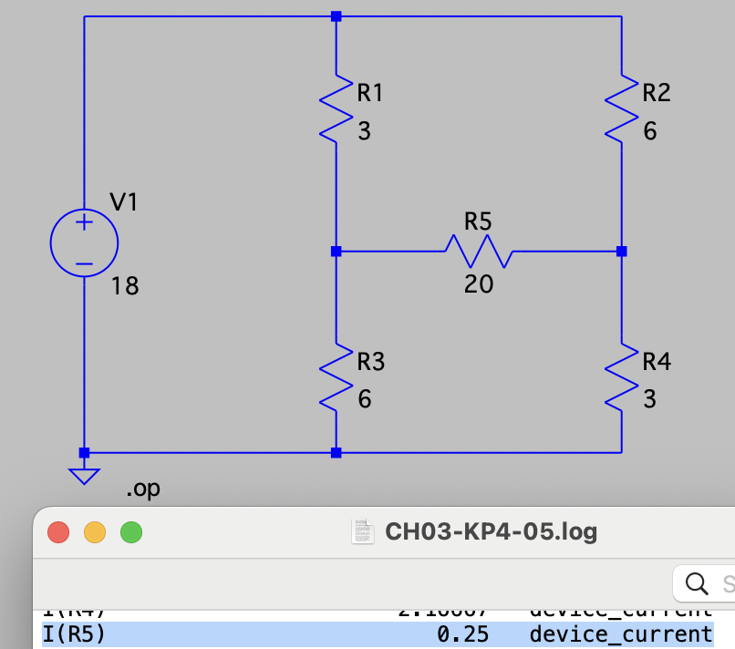 |

解析：

> 求出 $I_x$ 所在支路之外电路的戴维南等效电路。
>$$
> \begin{cases}
> u_{oc}=\frac{6}{3+6}×18-\frac{3}{3+6}×18=6V \\
> R_{eq}=\frac{3×6}{3+6}+\frac{6×3}{6+3}=4Ω \\
> ∴I_x=\frac{U_{oc}}{R_{eq}+20}=\frac{6}{4+20}=0.25A
> \end{cases}
> $$
> 等效电路：
> 
> 

**`CH03-KP4-06`**: 求下图所示单口网络的戴维南等效电路。

解析：

> (1) 先求开路电压：
>
> 根据节点法有：
>
> $\begin{cases} (\frac{1}{10}+\frac{1}{10})v_{n1}-\frac{1}{10}v_{oc}=2 \\ -\frac{1}{10}v_{n1}+(\frac{1}{20}+\frac{1}{10})v_{oc}=1+\frac{5}{20} \end{cases}$ 	解得：$v_{oc}=22.5V$ 
>
> 
>
> (2) 再求戴维南等效电阻：
>
> $R_o=20Ω||(10Ω+10Ω)=\frac{20×20}{20+20}=10Ω$ 
>
> (3) 等效电路图如下：
>
> 

**`CH03-KP4-07`**: 求如图所示电路的戴维南等效电路。

解析：

> (1)  求开路电压
>
> ​	  规定顺时针为电流正方向，则根据 KCL 流经 5 Ω 的电流为 $-I_1$ ， 流经 1 Ω 的电流为 $I_1$ ，则有
>
> ​	  $-12+1 \times I_1+5 \times (-I_1) + 10 \times I_1=0$ 
>
> ​	  解得：$I_1=2{\rm A}$ 
>
> ​	  $V_{Th}=10I_1=20{\rm V}$ 
>
> (2)  求等效电阻
>
> ​	  在端口施加一电压 $U$ ，独立电压源短路。
>
> ​	  规定顺时针为电流正方向，则根据 KCL 流经 5 Ω 的电流为 $-(I + I_1)$ ， 流经 1 Ω 的电流为 $I_1 - I$  ，得到：
>
> ​	  $1 \times (I_1-I)+5 \times (-I-I_1)+10 \times I_1 = 0$ 
>
> ​	  获得 $I=I_1$，则 $U=10I_1+5I=15 I$ 
>
> ​	  $R_{Th}=\frac{U}{I}=15{\Omega}$ 
>
> (3)  画出戴维南等效电路
>
> 

**`CH03-KP4-08`**: 求下图中，ab 端所见的戴维南等效电路

解析：

> 
>
> 

**`CH03-KP4-09`**: 计算并画出下图所示电路的戴维南等效电路。

解析：

>(1)	首先，根据 $Y-\Delta$ 变换关系，且为了方便 $I$计算，将10 ohm 转化为 10/3 ohm，再与 5 ohm 并联，得到：${Z_Y}^{'}=2{\rm \Omega}$；整理得到变换后的电路图如下所示：
>
>
>
>(2)	求开路电压 $v_{oc}$。
>
>​		由流经 $R_4$ 的电流为 $I$，可以得到节点2电压为 $v_2=2I$；
>
>​		因此，流经 $R_3$、$R_5$ 的电流为 $0.5I$；
>
>​		流经 $R_2$ 的电流为 $I+0.5I=1.5I$；方向由左至右；
>
>​		节点1处由 KCL 可得，流经 $R_1$ 的电流为 $0.5I$，方向由左至右。
>
>​		列网孔电流方程有：
>
>​		$R_1 \times 0.5I+R_2 \times 1.5I + R_4 \times I = 8{\rm V}$，代入解得：$I=1{\rm A}$ 
>
>​		开路电压 $v_{oc}=R_5 \times 0.5I=1{\rm V}$。
>
>(3)	求等效电阻 $R_o$ 。
>
>​		在端口施加一电压 $v=1{\rm V}$，独立电压源短路。
>
>​		则 $v_3=1{\rm V}$，$v_2=2I$；
>
>​			 $I_{R_5}=\frac{v_3}{R_5}=0.5{\rm A}$，方向由上至下；
>
>​			 $I_{R_3}=\frac{v_3-v_2}{R_3}=\frac{1-2I}{2}=0.5-I$，方向由右至左；
>
>​			 $I_{R_2}=I_{R_3}-I_{R_4}=0.5-2I$，方向由右至左；
>
>​			 $I_{R_1}=I_{R_2}+I=0.5-I$，方向由右至左；
>
>​		根据 $v_2=I_{R_2}R_2+I_{R_1}R_1=IR_4$ 代入得到：
>
>​			 $2 \times (0.5-2I)+6 \times (0.5-I)=2 \times I$ 
>
>​		解得：$I=\frac{1}{3}{\rm A}$ 
>
>​		因此，$I_o=I_{R_3}+I_{R_5}=(0.5-\frac{1}{3})+\frac{1}{2}=\frac{2}{3}{\rm A}$，$R_o=\frac{v}{I_o}=1.5{\rm \Omega}$ 
>
>(4)	画出戴维南等效电路如下
>
>

## 知识点5：诺顿定理

**`CH03-KP5-01`**: 下图所示电路中，ab 两端的诺顿等效电路是 ________ 。

A. 				

B. 

C. 				

D. 

| 参考答案 | C    |
| -------- | ---- |

解析：

> 等效电阻，12 V 短路，流过 6 ohm 电流是$-I_1$，则流过 3 ohm 电流是$-2I_1$，因此端口电流是$-12I_1$，端口电压为 3 ohm 上的电压，即$-2I_1\times 3 = -6 I_1$，端口电压除以端口电流 = 0.5 ohm；短路电流，$I_1=2A$，端口电流 $10I_1=20A$，故为 C

**`CH03-KP5-02`**: 求下列电路$ab$端口的诺顿等效电路

解析：

> 

## 知识点6：最大功率传输

**`CH03-KP6-01`**: 当负载获取最大功率时，电路的传输效率 ________ 是50%。

A. 一定		

B. 不一定

| 参考答案 | B    |
| -------- | ---- |

解析：

> 一端口网络等效电阻消耗的功率有可能不等于等效前网络内部电阻消耗的功率，因此当负载获取最大功率时，电路的传输效率并不一定等于50%；比如下图最大功率传输时，效率仅16.7%
>
> 

**`CH03-KP6-02`**: 下图所示电路中负载电阻 $R_L$ 为何值时获得最大功率。

| 参考答案  | 6 Ω                                                          |
| --------- | ------------------------------------------------------------ |
| SPICE仿真 | 仿真文件见 Github `spice/ch03/CH03-KP6-02.asc` 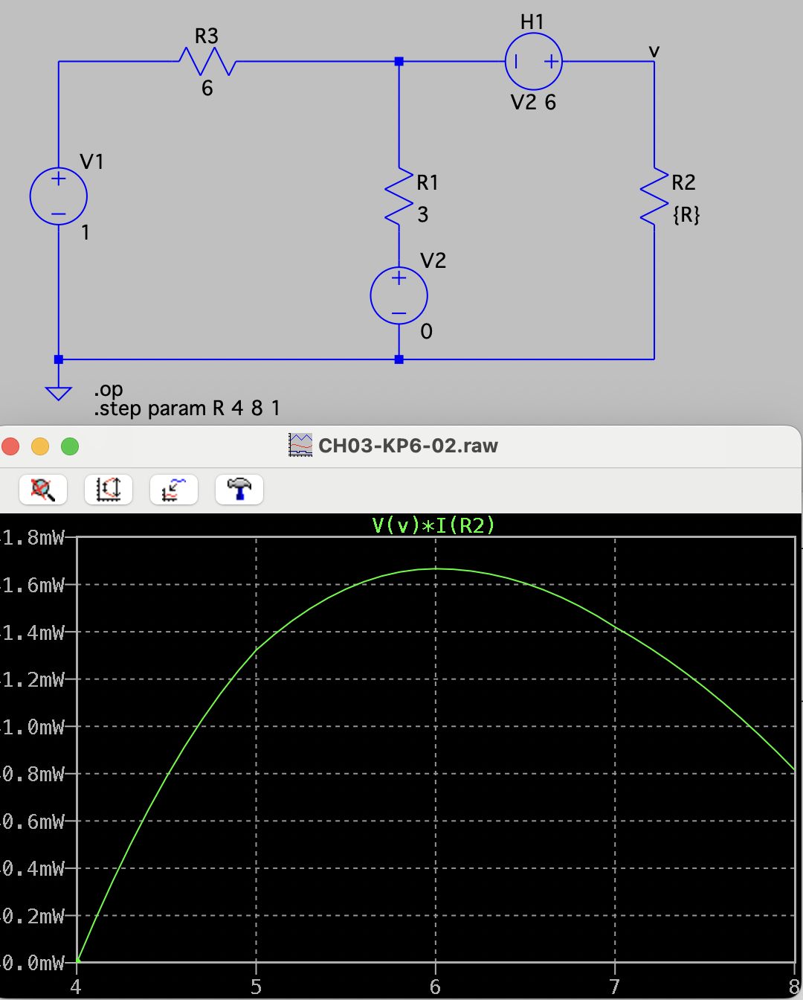 |

解析：

> 先求等效电阻。
>
> 
>
> $i=i_1+\frac{3i_1}{6}=1.5i_1$ 
>
> $v=6i_1+3i_1=9i_1$ 
>
> $R_{in}=\frac{v}{i}=\frac{9i_1}{1.5i_1}=6\,\Omega$ 
>
> 因此，当 $R_L=R_{in}=6\,\Omega$ 时负载电阻 $R_L$ 可获得最大功率。

**`CH03-KP6-03`**: 当负载获取最大输出功率时，电路的传输效率一定是 ________ 。

A. 100％				

B. 50％				

C. 25％				

D. 不能确定

| 参考答案 | D    |
| -------- | ---- |

解析：

> 见`CH03-KP6-01`

**`CH03-KP6-04`**: 下列电路中，$R_L$取什么值时可以获得最大功率传输，并计算该最大功率

| 参考答案 | $R_L$ 取 4.22 Ω 时，可获得最大功率 2.90 W |
| -------- | ----------------------------------------- |

解析：

> 

**`CH03-KP6-05`**: 下图所示的负载电阻 $R_L$ 可变，试问 $R_L$ 等于何值时可吸收最大功率？求此功率 $P_{Lmax}$ 以及电压源发出的功率 $P_S$。

| 参考答案 | $R_L$ 取 4 Ω 时，可获得最大功率 2.25 W；电压源发出功率3.75 W |
| -------- | ------------------------------------------------------------ |

解析：

> 把负载电阻 $R_L$以外的电路进行戴维南等效。
>
> 先求开路电压：
>
> 
>
> 
>
> 然后求等效输入电阻 $R_{TH}$：
>
> 
>
> 
>
> 
>
> 最后求电源发出的功率：
>
> 
>
> 

**`CH03-KP6-06`**: 在下图所示的电路中，设信号源内阻 $R_S$ 的值是 3 Ω，则 $R_L$ 为________ Ω 时，其上得到的功率最大，  则 $R_L$ 为________ Ω 时，信号源 $V_S$ 输出的功率最大。 

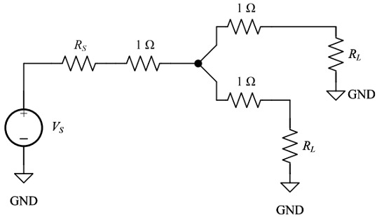

| 参考答案  | 9 Ω; 0 Ω                                                     |
| --------- | ------------------------------------------------------------ |
| SPICE仿真 | 仿真文件见 Github `spice/ch03/CH03-KP6-06.asc` 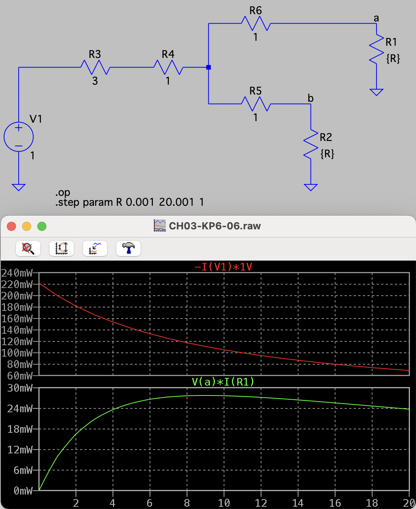 |

解析：

>1. 因负载的两个分支完全一样，故可以将其并联分析；问题等价为电压源 $V_S$ 串联一个 4.5 Ω 的电阻和一个 $0.5 R_L$的负载电阻，所以当 $R_L = 9\,\Omega$ 时负载得到的功率最大。
>
>2. $V_S$ 为恒压源，当输出电流最大时其输出的功率最大，故 $R_L$ 取最小值 0 Ω 时 $V_S$ 输出功率最大。
