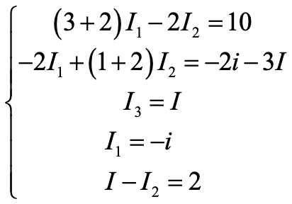

# 电路分析的基本方法和定理

::: info

**3.**  **电路分析的基本方法和定理**（建议4学时）

3.1 电路分析基础（支路、节点、回路和网孔）

3.2 网孔电流法（包括不含受控源和含受控源的电路的分析）

3.3 节点电压法（包括不含受控源和含受控源的电路的分析）

3.4* 修正节点法

3.5 电路定理

3.5.1 叠加定理

3.5.2 替代定理

3.5.3 戴维南定理和诺顿定理

3.5.4 最大功率传递定理

:::

::: tip

1. 网孔电流法

   * 以 $l$ 个网孔电流为变量，对 $l$ 个网孔列KVL方程，求解线性方程组；

   * 若含电流源，因电流源两端电压不能确定，故采用超级网孔避开电流源，再列线性方程求解；
2. 节点电压法

   *  以 *n*-1 个节点电压为变量，对 *n*-1 个节点列 *n*-1 个KCL方程，求解线性方程组；

   *  若含电压源，因流过电压源的电流不能确定，故采用广义节点把电压源包含进来，再列线性方程组求解；
3. 叠加定理（线性电路齐次性）

   * 线性：齐次性、可加性
   * 功率不可直接叠加

   * 分别计算每个独立源的贡献（考虑一个独立源时，其他独立源均设为零/turn off），再线性叠加；适用于有多个独立源的线性电路
4. 替代定理：保持接口电压或电流不变，用电压源或电流源替代
5. 戴维南定理：开路电压 & 等效电阻
6. 诺顿定理：短路电流 & 等效电阻
7. 最大功率传递定理：
   * 对于电阻网络，负载电阻 = 戴维南等效电阻
   * 最大功率传输时，效率并不一定等于50%

:::

# 习题及参考解答

## 知识点1：网孔电流法

**`CH03-KP1-01`**: 用网孔电流法求解下图所示电路中的三个网孔电流 $I_1$、$I_2$ 和 $I_3$ 。

| 参考答案  | $I_1 = 1.84\,\rm{A}$; $I_2 = 0.68\,\rm{A}$; $I_3 = 2.68\,\rm{A}$ |
| --------- | ------------------------------------------------------------ |
| SPICE仿真 | 仿真文件见 Github `kicad/ch3/CH03-KP1-01.kicad_sch`  |
| Math      | 数学计算文件见 Github `kicad/ch3/CH03_KP1_01.m`              |

解析：

> 对三个 mesh 列 KVL 方程，其中 mesh 2 和 mesh 3 构成 supermesh：
> $$
> \begin{cases}
> (1+2+5)I_1-2I_2-5I_3=0 \\
> -26 + (2+4)I_2 - 2I_1 + (5+8)I_3 - 5I_1 = 0 \\
> I_3-I_2=2
> \end{cases}
> $$
>
> ​        计算得： $I_1=1.84A,I_2=0.68A,I_3=2.68A$ 
>
> 

**`CH03-KP1-02`**: 回路电流法是根据 ________ 定律列出的；节点电压法是根据 ________ 定律列出的。

| 参考答案 | KVL；KCL |
| -------- | -------- |

解析：

> 对 loop 列 KVL；对节点列 KCL

**`CH03-KP1-03`**: 用网孔法求下图所示电路中支路电流 $I_4$ 。

| 参考答案  | 1.42 A                                                       |
| --------- | ------------------------------------------------------------ |
| SPICE仿真 | 仿真文件见 Github `kicad/ch3/CH03-KP1-03.kicad_sch`  |
| Math      | 数学计算文件见 Github `kicad/ch3/CH03_KP1_03.m`              |

解析：

> 设回路电流 $I_a$ 、$I_b$ 和 $I_c$ ，参考方向如图所示。
>
> 
>
> (1) 对三个 mesh 列 KVL 方程
>$$
> \begin{cases}
> -2 + 4I_a - 3I_b = 0 \\
> -3I_a + 6I_b - I_c + 3U_2 = 0 \\
> -3U_2 -I_b + 3I_c = 0
> \end{cases}
> $$
> (2) 将 $U_2$ 用 mesh 电流表示
> $$
> U_2 = 3(I_b - I_a)
> $$
> 可以解得：
> $$
> \begin{cases}
> I_a = 1.186 A \\
> I_b = 0.915 A \\
> I_c = -0.508 A
> \end{cases}
> $$
> 故有 $I_4 = I_b - I_c = 1.42 A$ 
> 
> 

**`CH03-KP1-04`**: 用网孔电流法求解下图所示电路中的支路电流 $i$ 。

| 参考答案  | 1.19 A                                                       |
| --------- | ------------------------------------------------------------ |
| SPICE仿真 | 仿真文件见 Github `kicad/ch3/CH03-KP1-04.kicad_sch`  |
| Math      | 数学计算文件见 Github `kicad/ch3/CH03_KP1_04.m`              |

解析：

> 设回路电流$I_1$ 、$I_2$ 和 $I_3$ ，参考方向如图所示。
>
> 
>
> 列网孔电流方程如下：
> $$
> \begin{cases}
> 6 = 12i_1 - 2i_2 \\
> -8 = 7i_2 -2i_1 -i_3 \\
> -8 + 6 + 6i_3 -i_2 = 0
> \end{cases}
> $$
> 解得： $i_1=0.329A,i_2=-1.026A,i_3=0.162A$ 
>
> 故而 $i=i_3-i_2=1.19A$ 
>
> 

**`CH03-KP1-05`**: 用网孔电流法求下图所示电路中的电流 $I_1$ 和 $V_o$ 。

| 参考答案 | $I_1 = 5\,\rm{A}$; $V_o = -42\,\rm{V}$          |
| -------- | ----------------------------------------------- |
| Math     | 数学计算文件见 Github `kicad/ch3/CH03_KP1_05.m` |

解析：

> 设回路电流 $I_1$ 、$I_2$ 和 $I_3$ ，参考方向如图所示。
>
> 
>
> 用网孔分析法列出电路方程
>$$
> \begin{cases}
> (R_1+R_2+R_3)I_1-R_2I_2-R_3I_3=0 \\
> -R_2I_1+(R_2+R_4+R_5)I_2-R_5I_3=-14 \\
> I_3=1.4I_1
> \end{cases}
> $$
> 将元件参数代入上述方程，得：
> $$
> \begin{cases}
> 21.5I_1-2.5I_2-15I_3=0 \\
> -2.5I_1+12.5I_2-2I_3=-14 \\
> I_3=1.4I_1
> \end{cases}
> $$
> 求解方程组，得：$I_1=5A,I_2=1A,I_3=7A$ 
> 
> 故而 $V_o=R_3(I_1-I_3)+R_5(I_2-I_3)=15×(5-7)+2×(1-7)=-42V$ 
>
> 

6、用网孔电流法求如下图所示电路中的电压 $v$。

> 解：
>
> 网孔电流都取顺时针方向，设受控电流源 $v$ 的电压为 $v_x$ ，参考极性上正下负.
>
> 
>
> 则根据网孔法有：
> $$
> \begin{cases}
> 2(i_{1}-i_3)+v_x-12=0 \\
> -v_x+(1+3)i_2-1×i_3=0 \\
> i_3=2
> \end{cases}
> $$
> 因受控电流源引入附加方程为 $i_1-i_2=v$ 
>
> 因受控源控制量 $v$ 引入的附加方程为 $v=3i_2$ 
>
> 联立解得：$\begin{cases} i_1=6A \\ i_2=1.5A \\ i_3 = 2A \end{cases}$ 	因此，$v=3i_2=4.5V$ 
>
> 

7、使用网孔电流法求解下图中 $i_1$、$i_2$、$i_3$。

> 解：
>
> 考虑到独立电流源的存在，将 $i_1$ 和 $i_2$ 所在的网孔并作一个 $supermesh$ 看待。
>
> 列网孔电流方程如下：
>
> $\begin{cases}	-8 +2(i_1-i_3)+4(i_2-i_3) + 8i_2 = 0 \\ 2(i_3-i_1)+2i_3+4(i_3-i_2)=0 \\ 	\end{cases}$ 
>
> 增补方程 $i_1-i_2=4$ 
>
> 联立解得：
>
> $i_1=\frac{88}{19}{\rm A},i_2=\frac{12}{19}{\rm A},i_3=\frac{28}{19}{\rm A}$ 
>
> 

8、列出图示电路的网孔电流方程,并求 $I$。

> 解：
>
> 设左、右、上方的三个网孔的电流依次为 ${I_1}$、${I_2}$、${I_3}$，方向为顺时针。
>
> 列网孔电流方程如下
>
> $\begin{cases}	5I_1-25+5(I_1-I_3)+20(I_1-I_2)=0 \\ 20(I_2-I_1)+4(I_2-I_3)+15I=0 \\ 5(I_3-I_1)+10I_3+4(I_3-I_2)=0 	\end{cases}$ 
>
> 其中，$I=I_1-I_2$ 
>
> 解得：$I=\frac{40}{81},I_1=\frac{155}{81},I_2=\frac{115}{81},I_3=\frac{65}{81}$ 
>
> 

9、用网孔电流法，求$I_o$

> 

10、求图中的三个网孔电流

> 

11、用网孔电流法，求下图中的 $i_o$

> 

12、用网孔电流法求下图所示电路中的支路电流 $i_a \sim i_e$ 。

> 解：
>
> 
>
> ​        $200=85i_1-25i_2-50i_3$ 
>
> ​		$0=-75i_1+35i_2+150i_3$ 		(supermesh)
>
> ​		$i_3-i_2=4.3(i_1-i_2)$ 
>
> 解得：$i_1=4.6{\rm A}$；	$i_2=5.7{\rm A}$；	$i_3=0.97{\rm A}$ 
>
> ​		$i_a=i_2=5.7{\rm A}$；		$i_b=i_1=4.6{\rm A}$；		$i_c=i_3=0.97{\rm A}$ 
>
> ​		$i_d=i_1-i_2=-1.1{\rm A}$；		$i_e=i_1-i_3=3.63{\rm A}$ 
>
> 另一种更标准的网孔电流方程如下：
>
> ​		$\left\{ \begin{array}{l}-25{i_1} + 35{i_2} =  - {V_0}\\85{i_1} - 25{i_2} - 50{i_3} = 200\\-50{i_1} + 150{i_3} = {V_0}\\{i_3} - {i_2} = 4.3\left( {{i_1} - {i_2}} \right)\end{array} \right.$ 
>
> 

13、用网孔电流法求下图所示电路中流过电阻*R*的电流 *I*。

> 将受控电流源转换为受控电压源。设从左到右3个网孔的电流分别为*I*1、*I*2、*I*3，电流参考方向均为顺时针方向。
>
> 
>
> 
>
> 得
>
> 

## 知识点2：节点电压法

1、用节点电压法求下图所示电路中的电压*U* 。

> 解：
>
> 

2、用节点电压法求解下图中的电流 $I_0$ 及电压 $V_1,V_2,V_3$ 。

> 解：
>
> 列节点电压方程如下：
> $$
> \begin{cases}
> V_1=10 V \\
> (V_2-V_1)/5+(V_2-V3)/2-2I_0=0 \\
> -I_0+(V_3-V_2)/2+V_3/8=0
> \end{cases}
> $$
> 增补方程 $I_0=(V_1-V_3)/4$ 
>
> 解得： $V_1=10 V,V_2=10 V_3=\frac{60}{7} V,I_0=\frac{5}{14} A$ 
>
> 

3、求以下无源单口网络的输入电阻 $R_i$ 。已知 $R_1$ = $R_2$ = $R_3$ = $R_4$ = $R_5$ = 3Ω，$R_6$ = 1Ω。

> 解：
>
> 方法1：
>
> 选取参考地，并对图中的节点电压进行标记如下：
>
> 
>
> 列节点电压方程如下：
> $$
> \begin{cases}
> V_1/R_2+(V_1-V_2)/R_5+(V_1-V_3)/R_1=0 \\
> V_2/R_4+(V_2-V_1)/R_5+(V_2-V_3)/R_3=0 \\
> V_3=3I×R_6 
> \end{cases}
> $$
> 为简化计算过程，可取 $I=1 A$ 
>
> 计算得到： $V_1=V_2=\frac{3}{2}V,V_3=3V,I_{in}=I+V_1/R_2+V_2/R_4=2A$ 
>
> 故而输入电阻 $R_i=\frac{U}{I_{in}}=\frac{V_3}{I_{in}}=\frac{3}{2}Ω$ 
>
> 
>
> 方法2：
>
> 左边电路用Y-$\Delta$ 化简，等效为3Ω电阻；右边电路令$I = 1A$, 电压=3V，即右边等效为3Ω，故整体等效电阻为1.5Ω

4、使用节点电压法求解下图中的 $v_1$ 、$v_2$ 和 $v_3$ 。

> 解：
>
> 列节点电压方程如下：
> $$
> \begin{cases}
> \frac{1}{2}V_1+\frac{1}{4}V_2+\frac{1}{3}V_3=0 \\
> V_1-V_2=25 \\
> V_3-V_2=5×\frac{1}{2}V_1
> \end{cases}
> $$
> 解得： $V_1=7.61V,V_2=-17.39V,V_3=1.63V$ 
>
> 

5、列写图示电路的节点电压方程。

> 解：
>
> 标记节点①~④如下图所示：
>
> 
>
> 列节点电压方程如下：
> $$
> \begin{cases}
> V_1=14 \\
> (\frac{1}{2}+\frac{1}{3}+\frac{1}{5})V_2-\frac{1}{2}V_1-\frac{1}{3}V_3=0 \\
> (\frac{1}{3}+\frac{1}{4})V_3-\frac{1}{4}V_1-\frac{1}{3}V_2=-\frac{12}{4}-5I_1
> \end{cases}
> $$
> 增补方程 $I_1=\frac{V_1-V_3-12}{4}$ 

6、用节点电压法分析如下电路，列出足够求解的方程。

> 解：
>
> 列三个节点方程如下：
> $$
> \begin{cases}
> (\frac{1}{R_1}+\frac{1}{R_2})U_1 - \frac{1}{R_2}U_2 = I_s \\
> -\frac{1}{R_2}U_1 + (\frac{1}{R_2}+\frac{1}{R_3})U_2 = g_mU_{R_2} \\
> \frac{1}{R_4}U_3 = -g_mU_{R_2}
> \end{cases}
> $$
> 另需要一个补充方程
> $$
> U_{R_2} = U_1 - U_2
> $$

7、用节点电压法求下图所示电路的节点电压 $V_{na}、V_{nb}、V_{nc}和i_x$ 。

> 解：
>
> 方法1：
>
> 设受控电压源流出的电流为 $i$ 
> $$
> \begin{cases}
> \frac{1}{90}V_{na}-\frac{1}{90}V_{nb}=2+i \\
> -\frac{1}{90}V_{na}+(\frac{1}{90}+\frac{1}{60}+\frac{1}{180})V_{nb}-\frac{1}{60}V_{nc}=0 \\
> -\frac{1}{60}V_{nb}+(\frac{1}{90}+\frac{1}{60})V_{nc}=-i \\
> V_{na}-V_{nc}=30i_x \\
> i_x=\frac{1}{90}(V_{na}-V_{nb})
> \end{cases}
> $$
> 解得： $V_{na}=135V,V_{nb}=108V,V_{nc}=126V,i=-1.7A,i_x=0.3A$ 
>
> 方法2：
> $$
> \begin{cases}
> \frac{1}{90}V_{na}-(\frac{1}{90}+\frac{1}{60})V_{nb}+(\frac{1}{90}+\frac{1}{60})V_{nc}=2 \\
> 对点b:-\frac{1}{90}V_{na}+(\frac{1}{90}+\frac{1}{60}+\frac{1}{180})V_{nb}-\frac{1}{60}V_{nc}=0 \\
> 另外,V_{na}-V_{nc}=30i_x=\frac{30}{90}(V_{na}-V_{nb})
> \end{cases}
> $$
>
> $$
> ⇒
> \begin{cases}
> 2V_{na}-5V_{nb}+5V_{nc}=360 \\
> -2V_{na}+6V_{nb}-3V_{nc}=0 \\
> 2V_{na}+V_{nb}-3V_{nc}=0
> \end{cases}
> ⇒
> \left(
> \begin{matrix}
> 	2 & -5 & 5 \\
> 	-2 & 6 & -3 \\
> 	2 & 1 & -3
> 	\end{matrix}
> \right)
> 
> \left(
> \begin{matrix}
> 	V_{na} \\
> 	V_{nb} \\
> 	V_{nc}
> 	\end{matrix}
> \right)
> =
> \left(
> \begin{matrix}
> 	360 \\
> 	0 \\
> 	0
> 	\end{matrix}
> \right)
> $$
>
> 解得：
> $$
> \left(
> \begin{matrix}
> 	V_{na} \\
> 	V_{nb} \\
> 	V_{nc}
> 	\end{matrix}
> \right)
> =
> \left(
> \begin{matrix}
> 	135 \\
> 	108 \\
> 	126
> 	\end{matrix}
> \right)V,i_x = 0.3
> $$
> 

8、用节点电压法求解下图所示电路中的支路电流 $I_b$ 。

> 解：
>
> 单节点
> $$
> \begin{cases}
> (\frac{1}{250}+\frac{1}{50}+\frac{1}{150})V=\frac{24}{250}+\frac{60I_b}{150} \\
> I_b=\frac{24-V}{250}
> \end{cases}
> $$
> 解得： $I_b=\frac{48}{605}≈0.079A$ 
>
> 

9、用节点电压法求以下电路中各节点的电压。

> 解：
>
> 假设 $v_{n3}=0V$ ，则有
> $$
> \begin{cases}
> (\frac{1}{2}+\frac{1}{3+2})v_{n1}-\frac{1}{2}v_{n2}=4-10 \\
> -\frac{1}{2}v_{n1}+(\frac{1}{2}+3+\frac{2×6}{2+6})v_{n2}=10
> \end{cases}
> $$
> 整理后，得到：
> $$
> \begin{cases}
> 0.7v_{n1}-0.5v_{n2}=-6 \\
> -0.5v_{n1}+5v_{n2}=10
> \end{cases}
> $$
> 解得：
> $$
> \begin{cases}
> v_{n1}≈-7.69V \\
> v_{n2}≈1.23V
> \end{cases}
> $$
> 

10、用节点电压法求下图所示电路中电流源两端的电压 *v* 。

> 解：
>
>   以底端节点作为参考节点，上端三个节点的节点电压分别为 $v_{n1}$ 、 $v_{n2}$ 和 $v_{n3}$ 。
>
>   因为与第一个节点相连接的 3 Ω 为多余电阻，则有：
> $$
>   \begin{cases}
>   (\frac{1}{2}+\frac{1}{2})v_{n1}-\frac{1}{2}v_{n2}-\frac{1}{2}v_{n3}=2 \\
>   v_{n2}=8 \\
>   -\frac{1}{2}v_{n1}-\frac{1}{2}v_{n2}+(\frac{1}{2}+\frac{1}{2}+\frac{1}{1})v_{n3}=v
>   \end{cases}
> $$
>   因受控源引入的附加方程为：
> $$
>   v_{n1}=v-2×3
> $$
>   解得：$\begin{cases} v_{n1}=13.6V \\ v_{n2}=8V \\ v_{n3}=15.2V \end{cases}$ 	得：$v=19.6V$ 
>
>   

11、列出图示电路的节点电压方程,并求 $I$。

> 解：
>
> 考虑到独立电压源的存在，将独立电压源及上方节点看做一个 $supernode$ 。记 $supernode$ 上、下方电压分别为 $v_a$ 和 $v_b$ 。
>
> 以底端节点为参考节点，$supernode$ 右侧的两个节点分别标记为 $v_1$ 和 $v_2$ 。
>
> 列节点电压方程如下：
>
> $\begin{cases}	\frac{v_a-v_2}{10}+\frac{v_a-v_1}{5}+\frac{v_b}{5}=0 \\ \frac{v_1-v_a}{5}+\frac{v_1-v_2}{4}+\frac{v_1}{20}=0 \\ v_2=15I	\end{cases}$ 
>
> 增补方程 $v_a-v_b=25$ ，$I=\frac{v_1}{20}$ 
>
> 联立解得：
>
> $v_a=\frac{1250}{81}{\rm V}$，$v_b=\frac{-775}{81}{\rm V}$，$v_1=\frac{800}{81}{\rm V}$，$v_2=\frac{600}{81}{\rm V}$，$I=\frac{40}{81}{\rm A}$ 

12、用节点电压法，求节点1、2、3的电压值

> 

13、用节点电压法，求下图中的 $V_x$

> 列方程如下：
>
> $\frac{v_1-20}{20} + \frac{v_1-0}{20} + \frac{v_2-0}{10} + \frac{v_2-v_3}{5} = 0$
>
> $\frac{v_3-v_2}{5} - 9 +\frac{v_3-0}{10} = 0$
>
> $v_2 - v_1 = 10$
>
> 求得 $V_x = v_2 = 30$ V

14、用节点电压法，求下图中的$V_o$

> 

15、求下图所示电路的节点电压 $v_1$，$v_2$，$v_3$。

> 解：
>
> $i_o=\frac{v_2}{40}$ 
>
> $-5i_o + \frac{v_1}{20} +\frac{v_1-v_2}{5}=0$ 		 		so	$10v_1-13v_2+0v_3=0$ 
>
> $\frac{v_2-v_1}{5}+\frac{v_2}{40}+\frac{v_2-v_3}{10}=0$ 				so	$-8v_1+13v_2-4v_3=0$ 
>
> $\frac{v_3-v_2}{10}+\frac{v_3-11.5i_o}{5}+\frac{v_3-96}{4}=0$ 	 so	$0v_1-63v_2+220v_3=9600$ 
>
> 解得：$v_1=156{\rm V}$；$v_2=120{\rm V}$；$v_3=78{\rm V}$ 

16、用节点电压法求下图所示电路的节点1、2、3和4的电压 $V_{n1}$、$V_{n2}$、$V_{n3}$ 和 $V_{n4}$。

>

## 知识点3：叠加定理

1、线性电路中，无法用叠加定理求解的物理量为 ________ 。

A. 功率	

B. 电压	

C. 电流	

D. 相位

> A，*功率是平方项关系，不符合线性性质*

2、右图所示电路中，电压U为 ________ 。

A. 4V	

B. 5V	

C. 6V	

D. 3V

> C，*只考虑6V时，电流源开路，U= 1V；只考虑6A时，5ohm和1ohm并联，等效为5/6ohm，U为5V，故总的U为1+5=6V*

3、叠加定理仅适用于 ________ 电路；在各分电路中，要把不作用的独立电源置零。不作用的独立电压源用 ________ 代替，不作用的独立电流源用 ________ 代替。

> 线性    
>
> 短路    
>
> 开路
>
> *turn off 对于独立电压源而言是短路（设电压=0），对于独立电流源而言是开路（设电流=0）*

4、叠加定理适用于 ________ 。

A. 线性电路		

B. 非线性电路		

C. 线性或非线性电路		

D. 无受控源的电路

> A，*叠加性的前提是线性*

5、下列物理量中不可用叠加定理计算的是 ________ 。

A. 电流			

B. 电压			

C. 功率

> C，*功率是二次项关系，非线性*

6、使用叠加原理计算下图所示电路中的电流 $I$。

> 解：
>
> (1) 保留 8 V 的电压源，turn off 2 A 的电流源和 6 V 的电压源
>
> ​	  $I_1=\frac{8}{16}=\frac{1}{2}A$ 
>
> (2) 保留 6 V 的电压源，turn off 2 A 的电流源和 8 V 的电压源
>
> ​	  $I_2=-\frac{6}{16}=-\frac{3}{8}A$ 
>
> (3) 保留 2 A 的电流源，turn off 6 V 的电压源和 8 V 的电压源
>
> ​	  $I_3=2×\frac{2}{14+2}=\frac{1}{4}A$ 
>
> 则  $I = I_1 + I_2 + I_3 = \frac{3}{8}A$ 

7、用叠加定理求下图所示电路中电流源两端的电压 *U*。

> 解：
>
> (1) 保留 2 A 的电流源，turn off 30 V 的电压源
>
> ​	  $R_{eq}=2Ω||3Ω+3Ω||6Ω=\frac{2×3}{2+3}+\frac{3×6}{3+6}=3.2Ω$ 
>
> ​	  $U_1=R_{eq}×2A=6.4V$ 
>
> (2) 保留 30 V 的电压源，turn off 2 A 的电流源
>
> ​	  $U_2=(30-30×\frac{3}{3+2})-(30-30×\frac{6}{6+3})=12V-10V=2V$ 
>
> ​	  $U=U_1+U_2=8.4V$ 

8、用叠加定理，求下图中的 $v_o$

> 
>
> 

9、采用电源变换和叠加原理，求下列电路中的 $i_o$

> 

10、如下图所示电路，求：

(1) 电压*V*；

(2) 电压源和受控源上的功率。

> (1) 受控源并联在电压源两端，不会对电路产生影响，可以忽略。使用叠加定理计算电压*V*：
>
> 当电流源开路，电压为两个6欧电阻分压，6 V;
>
> 当电压源短路，电路如下，电压为1 A电流源流过两个6欧电阻并联，-3 V;
>
> 
>
> 故 *V* = 6 – 3 = 3 V
>
> (2) 受控源上的电流是6 A，电压12 V，故消耗功率是72 W。
>
> 左上6欧电阻的电流是3/6+1=1.5 A，
>
> 设通过右上10欧电阻的电流是*i*，参考方向向下，则
>
> 10*i*+2(*i*+1)=12，得
>
> *i* = 5/6 A，
>
> 故电压源出来的电流是6+1.5+5/6=25/3 A，
>
> 输出功率 $P_S = 12 \times \frac{25}{3} = 100 W$

## 知识点4：戴维南定理

1、用戴维南定理求 $V$ 。

> 解：
>
> (1) 求开路电压：a、b 开路， $I=0,V_{oc}=10V$ 
>
> (2) turn off 独立源，求 $R_o$ ：加压求流法
>
> 
>
> 得到： $V_o=(I_o-0.5I_o)×10^3+I_o×10^3=1500I_o$ 
>
> 故而	$R_o=V_o/I_o=1.5kΩ$ 
>
> (3) 等效电路：
>
> 将 $R_0=1.5kΩ,V_{oc}=10V$ 代入右侧的等效电路图中，
>
> 得到： $V=V_{oc}×500/(1500+500)=2.5V$ 

2、下图所示电路的戴维南等效电路是 ________ 。

A. 	

B. 	

C. 	

D. 

> A。*等效电阻：电压源短路，电流源开路，所以是5ohm；开路电压：利用叠加定理，先考虑2V，得到2V，再考虑两个电流源0.5A，得到-2V，再考虑1A，得到5V，所以总计2-2+5 = 5V；故为A*

3、将下图 (a) 电路等效为图 (b) 电路，可求得输出端短路电流 $I$ = ________ 。

> $-0.5A$ *开路电压：$\frac{-4}{15}V$，等效电阻：$\frac{-8}{15}\ohm$， 所以短路电流为 $-0.5$ A*

4、求下图所示电路的戴维南等效电路。

> 解：
>
> (1) 首先求开路电压 $v_{OC}$ 。采用节点分析法来求解。
>
> 
>
>
> $$
> \begin{cases}
> (\frac{1}{1}+\frac{1}{2})v_{OC}-\frac{1}{1}×v_{n2}-\frac{1}{2}×v_{n3}=\frac{3}{4}v_{OC} \\
> -(\frac{1}{1}+\frac{1}{2})v_{OC}+(\frac{1}{1}+\frac{1}{1})v_{n2}+(\frac{1}{1}+\frac{1}{2})v_{n3}=0 \\
> v_{n2}-v_{n3}=1
> \end{cases}
> $$
> 解得： $v_{OC}=\frac{4}{3}V≈1.33V$ 
>
> 
>
> (2) 然后求等效电阻 $R_o$ 
>
> ​	 在端口施加一电压 $v$ ，独立电压源短路，与受控电流源串联的电阻可以视为短路，得到：
>
> 
>
> ​	  则 $i=0.75v+\frac{-v}{1Ω||2Ω+1Ω||1Ω}=0.75v+\frac{-v}{\frac{2}{3}+\frac{1}{2}}⇒v=-\frac{28}{3}i$ 
>
> ​		 $R_o=-\frac{v}{i}=\frac{28}{3}Ω≈9.33Ω$ 
>
> ​	  因此，原电路的戴维南等效电路如下所示：
>
> 

5、如下图所示电路，当 $R_x=20Ω$ 时，求电流 $I_x$ 。

> 解：
>
> 求出 $I_x$ 所在支路之外电路的戴维宁等效电路。
> $$
> \begin{cases}
> u_{oc}=\frac{6}{3+6}×18-\frac{3}{3+6}×18=6V \\
> R_{eq}=\frac{3×6}{3+6}+\frac{6×3}{6+3}=4Ω \\
> ∴I_x=\frac{U_{oc}}{R_{eq}+20}=\frac{6}{4+20}=0.25A
> \end{cases}
> $$
> 等效电路：
>
> 

6、求下图所示单口网络的戴维南等效电路。

> 解：
>
> (1) 先求开路电压：
>
> 根据节点法有：
>
> $\begin{cases} (\frac{1}{10}+\frac{1}{10})v_{n1}-\frac{1}{10}v_{oc}=2 \\ -\frac{1}{10}v_{n1}+(\frac{1}{20}+\frac{1}{10})v_{oc}=1+\frac{5}{20} \end{cases}$ 	解得：$v_{oc}=22.5V$ 
>
> 
>
> (2) 再求戴维南等效电阻：
>
> $R_o=20Ω||(10Ω+10Ω)=\frac{20×20}{20+20}=10Ω$ 
>
> (3) 等效电路图如下：
>
> 

7、求如图所示电路的戴维南等效电路。

> 解：
>
> (1)  求开路电压
>
> ​	  规定顺时针为电流正方向，则根据 KCL 流经 5 Ω 的电流为 $-I_1$ ， 流经 1 Ω 的电流为 $I_1$ ，则有
>
> ​	  $-12+1 \times I_1+5 \times (-I_1) + 10 \times I_1=0$ 
>
> ​	  解得：$I_1=2{\rm A}$ 
>
> ​	  $V_{Th}=10I_1=20{\rm V}$ 
>
> (2)  求等效电阻
>
> ​	  在端口施加一电压 $U$ ，独立电压源短路。
>
> ​	  规定顺时针为电流正方向，则根据 KCL 流经 5 Ω 的电流为 $-(I + I_1)$ ， 流经 1 Ω 的电流为 $I_1 - I$  ，得到：
>
> ​	  $1 \times (I_1-I)+5 \times (-I-I_1)+10 \times I_1 = 0$ 
>
> ​	  获得 $I=I_1$，则 $U=10I_1+5I=15 I$ 
>
> ​	  $R_{Th}=\frac{U}{I}=15{\Omega}$ 
>
> (3)  画出戴维南等效电路
>
> 

8、求下图中，ab端所见的戴维南等效电路

> 
>
> 

9、计算并画出下图所示电路的戴维南等效电路。

>解：
>
>(1)	首先，根据 $Y-\Delta$ 变换关系，且为了方便 $I$计算，将10 ohm 转化为 10/3 ohm，再与 5 ohm 并联，得到：${Z_Y}^{'}=2{\rm \Omega}$；整理得到变换后的电路图如下所示：
>
>
>
>(2)	求开路电压 $v_{oc}$。
>
>​		由流经 $R_4$ 的电流为 $I$，可以得到节点2电压为 $v_2=2I$；
>
>​		因此，流经 $R_3$、$R_5$ 的电流为 $0.5I$；
>
>​		流经 $R_2$ 的电流为 $I+0.5I=1.5I$；方向由左至右；
>
>​		节点1处由 KCL 可得，流经 $R_1$ 的电流为 $0.5I$，方向由左至右。
>
>​		列网孔电流方程有：
>
>​		$R_1 \times 0.5I+R_2 \times 1.5I + R_4 \times I = 8{\rm V}$，代入解得：$I=1{\rm A}$ 
>
>​		开路电压 $v_{oc}=R_5 \times 0.5I=1{\rm V}$。
>
>(3)	求等效电阻 $R_o$ 。
>
>​		在端口施加一电压 $v=1{\rm V}$，独立电压源短路。
>
>​		则 $v_3=1{\rm V}$，$v_2=2I$；
>
>​			 $I_{R_5}=\frac{v_3}{R_5}=0.5{\rm A}$，方向由上至下；
>
>​			 $I_{R_3}=\frac{v_3-v_2}{R_3}=\frac{1-2I}{2}=0.5-I$，方向由右至左；
>
>​			 $I_{R_2}=I_{R_3}-I_{R_4}=0.5-2I$，方向由右至左；
>
>​			 $I_{R_1}=I_{R_2}+I=0.5-I$，方向由右至左；
>
>​		根据 $v_2=I_{R_2}R_2+I_{R_1}R_1=IR_4$ 代入得到：
>
>​			 $2 \times (0.5-2I)+6 \times (0.5-I)=2 \times I$ 
>
>​		解得：$I=\frac{1}{3}{\rm A}$ 
>
>​		因此，$I_o=I_{R_3}+I_{R_5}=(0.5-\frac{1}{3})+\frac{1}{2}=\frac{2}{3}{\rm A}$，$R_o=\frac{v}{I_o}=1.5{\rm \Omega}$ 
>
>(4)	画出戴维南等效电路如下
>
>

## 知识点5：诺顿定理

1、下图所示电路中，ab 两端的诺顿等效电路是 ________ 。

A. 				

B. 

C. 				

D. 

> C, *等效电阻，12V短路，流过6ohm电流是$-I_1$，则流过3ohm电流是$-2I_1$，因此端口电流是$-12I_1$，端口电压为3ohm上的电压，即$-2I_1\times 3 = -6 I_1$，端口电压除以端口电流= 0.5ohm；短路电流，$I_1=2A$，端口电流$10I_1=20A$，故为C*

2、求下列电路$ab$端口的诺顿等效电路

> 

## 知识点6： 最大功率传输

1、当负载获取最大功率时，电路的传输效率 ________ 是50%。

A. 一定		

B. 不一定

> B，*一端口网络等效电阻消耗的功率有可能不等于等效前网络内部电阻消耗的功率，因此当负载获取最大功率时，电路的传输效率并不一定等于50%；比如下图最大功率传输时，效率仅16.7%*
>
> 

2、下图所示电路中负载电阻 $R_L$ 为何值时获得最大功率。

> 解：
>
> 先求等效电阻。
>
> 
>
> $i=i_1+\frac{3i_1}{6}=1.5i_1$ 
>
> $v=6i_1+3i_1=9i_1$ 
>
> $R_{in}=\frac{v}{i}=\frac{9i_1}{1.5i_1}=6Ω$ 
>
> 因此，当 $R_L=R_{in}=6Ω$ 时负载电阻 $R_L$ 可获得最大功率。

3、当负载获取最大输出功率时，电路的传输效率一定是 ________ 。

A. 100％				

B. 50％				

C. 25％				

D. 不能确定

> D，*见上上题解释*

4、下列电路中，$R_L$取什么值时可以获得最大功率传输，并计算该最大功率

> 

5、下图所示的负载电阻 $R_L$ 可变，试问 $R_L$ 等于何值时可吸收最大功率？求此功率 $P_{Lmax}$ 以及电压源发出的功率 $P_S$。

> 把负载电阻 $R_L$以外的电路进行戴维南等效。
>
> 先求开路电压：
>
> 
>
> 
>
> 然后求等效输入电阻 $R_{TH}$：
>
> 
>
> 
>
> 
>
> 最后求电源发出的功率：
>
> 
>
> 
