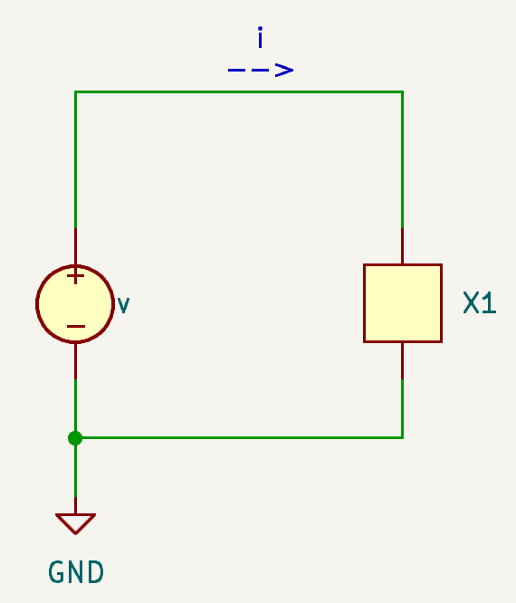
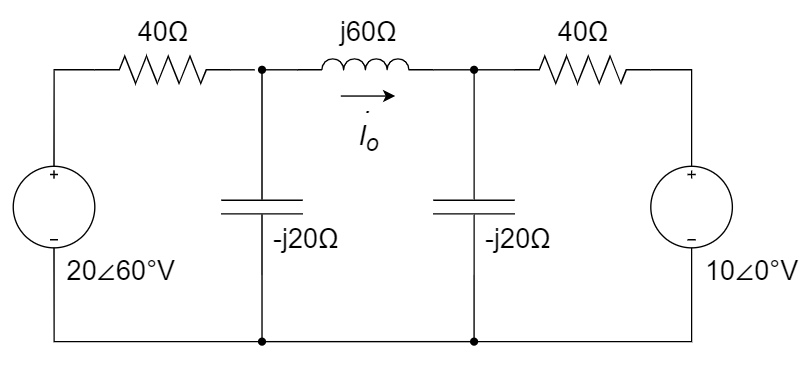
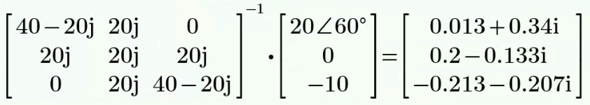
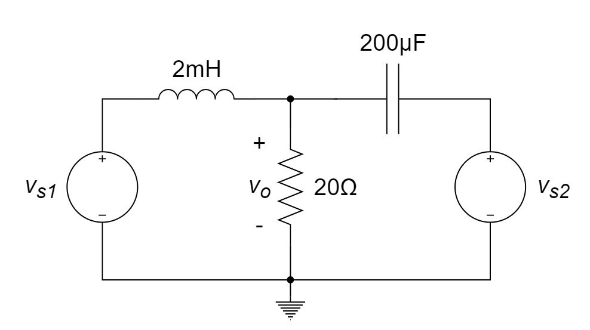
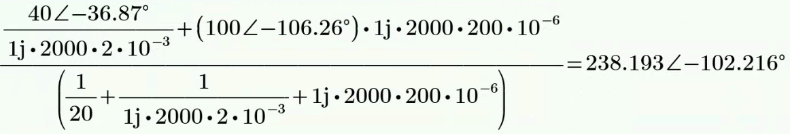

# 正弦稳态电路的相量分析

::: info

**5.** **正弦稳态电路的相量分析**（建议2学时）

5.1 正弦量的基本概念

​    5.1.1  正弦量的重要特性参数

​    5.1.2  正弦量的相量表示

5.2 正弦稳态电路的相量分析方法

​    5.2.1 电路基本物理量的相量描述

​    5.2.2 基尔霍夫定律的相量形式

​    5.2.3 电路定理在相量域的推广（包括叠加定理、戴维南定理和诺顿定理）

​    5.2.4 电路分析方法在相量域的推广（包括网孔电流法和节点电压法）

:::

::: tip

1. 三角函数图示记忆方法

2. 正弦交流电量的概念与特性参数

   - $v(t) = V_m \sin(\omega t + \phi)$

     - $V_m$, 幅值（amplitude），或振幅

     - $\omega$, 角频率（angular frequency）

     - $\phi$, 相位（phase），或“初始相位”

     - $\omega t + \phi$, 幅角（argument），或“相位”
     - **正弦函数的三要素：幅值、角频率、初始相位**

   - $v_2 = V_m \sin(\omega t + \phi)$ 瞬时电压**超前（leads）** $v_1 = V_m \sin(\omega t)$ 瞬时电压 $\phi$ 相位

   - 有效值：一个时变周期电压在一个周期内消耗在电阻上的功率，可以用一个恒定的电压来等效，该恒定电压就是该时变电压的有效值。当时变电压为**正弦函数时**，有效值为其峰值的 $\frac{1}{\sqrt{2}}$

3. 相量形式与相量图

   - 相量（phasor）是由正弦信号的振幅（$V_m$）和相位（$\phi$）构成的一个复数

     

   - 时域 to 相量域（频域），好处是少了时间量，代价是需要复数运算

     - 时域 to 相量域：pick up 振幅和相位，构成一个复数，隐含频率信息 ($\omega$)

     - 相量域 to 时域：乘以 $e^{j \omega t}$ 取实部，$v(t) = \rm{Re}(\textbf{V} e^{j \omega t})$

     - 在相量域更容易处理积分和微分

       

   - 电路分析中，时域量常用余弦形式表示，但正弦形式也是可以的

   - 相量分析法：

     - step 1: 电源、RLC元件等相关电路参量转换到相量域；

     

     - step 2: 在相量域进行电路分析；
     - step 3: 将结果从相量域转换到时域；
     - tips: 如果初始电路含有不同的 $\omega$，则需对不同 $\omega$ 单独分析，**在时域上叠加**；

   - 阻抗和导纳：电阻和电导在频域中的推广

     - $Z = R + jX$；$Z$（阻抗），$R$（电阻），$X$（电抗） ；
     - $Y = G + jB$，$Y$（导纳），$G$（电导），$B$（电纳）；

   - 相量图即复平面图

     - 因为较多情况是“施加电压，求电流”，所以在描述相位关系时，常用“电流超前/滞后电压多少相位”的形式

     - 感性电路，电流滞后电压

     - 容性电路，电流超前电压

       

4. 频域（相量域）的相关电路定理：
   - 时域中的电路定理**在相量域中同样适用**
   - 叠加定理需注意：电路中若有不同的频率，只能时域叠加，不能相量域叠加

:::

# 习题及参考解答

## 知识点1：正弦交流量的概念与特性参数

1、有效值为 1V 的正弦交流电压信号衰减 3dB 之后的信号最大值是 ________  V。

A.$\frac{1}{2}$	

B.$\frac{1}{\sqrt{2}}$	

C.1	

D.$\sqrt{2}$

> C，*对于正弦波，有效值为峰值的 $\frac{1}{\sqrt{2}}$; 3dB 表示半功率，也即电压幅度为峰值$\frac{1}{\sqrt{2}}$*

2、正弦交流激励下，电容两端的电压 ________ 通过它的电流 ________ 度。

A. 超前	

B. 滞后	

C. 45	

D. 90	

E. 180

> B
>
> D
>
> *根据电容电压电流的频域约束关系, $V= \frac{1}{j\omega C}I$*

3、正弦交流激励下，电感两端的电压 ________ 通过它的电流 ________ 度。

A. 超前	

B. 滞后	

C. 45	

D. 90	

E. 180

> A
>
> D
>
> 根据电感电压电流的频域约束关系, $V= j\omega L I$

4、电流 $i_1=10\cos(100πt+30°)$ 和 $i_2=10\sin(100πt-15°)$ 相位差是 ________ ，其中相位超前的是 ________ 。

> 135°      
>
> $i_1$ ， *将 $i_2$ 转换成 $\cos$ 形式后再比较*

5、正弦电压 $u(t)=\sqrt{2}Ucos(wt+θ_u)$ 对应的相量表示为 ________ 。

A. $U=U∠θ_u$ 		

B. $\vec{U}=U∠θ_u$ 		

C. $U=\sqrt{2}U∠θ_u$ 		

D. $\vec{U}=\sqrt{2}U∠θ_u$ 

> D， *根据定义*

6、正弦量的三要素为________ 、________ 和 ________。

> 幅值      
>
> 角频率      
>
> 初相位

7、电流 $i_1(t)=5\cos(100πt-30°)$ 的相位 ________ （超前/滞后）$i_2(t)=-10\cos(100πt+30°)$ ________ 度。

> 超前      
>
> 120
>
> *把负号放到cos表达式里面后再比较*

8、电压 $u=20\sin(219t+18°)$ 与电流 $i=2\cos(219t-18°)$ 相比，相位差为 ________ 。

A. 超前54°		

B. 滞后54°		

C. 超前36°		

D. 滞后36°

> B
>
> *把sin转换为cos，或把cos转换为sin后再比较*

9、正弦电压向量为 $\vec{U}=15∠26°$ （15是有效值），频率为 50 Hz ，则它对应的瞬时表达式为 ________ 。

A. $u(t) = 15\cos(314t + 26°)$          

B. $u(t) = 15\cos(50t+26°)$

C. $u(t) = 21.21\cos(50t+26°)$      

D. $u(t) = 21.21\cos(314t+26°)$​

> D
>
> *根据定义*

10、已知两个支路的电流分别可表示为 $i_1(t)=10\cos(100πt+\frac{3\pi}{4})$，$i_2(t)=10\cos(100πt-\frac{\pi}{2})$，比较两者的相位，前者 ________ （超前/滞后）后者 ________ 度。

> 滞后      
>
> 135
>
> *按惯例，超前或滞后角度的绝对值不超过180°*

11、两同频率的正弦电压可表示为 $v_1=-10\sin(\omega t+30°){\rm V}$，$v_2=4\cos(\omega t+60°){\rm V}$，则它们的相位差为 ________ 。

A. 30°		

B. 60°		

C. 120°		

D. 150°

> B
>
> *化成相同的形式再比较*

12、(1)  根据下图的相量图，求 $\vec{V_1}+\vec{V_2}$ 的相量；

​		(2)  正弦变量 $v_s=-10\sin(\omega t -\pi/3)$ 对应的相量为？

> (1)  方法1：图解法
>
> 
>
> ​	  由图可得：$\vec{V}=\vec{V_1}+\vec{V_2}=6\angle90°{\rm V}$ 
>
> ​	  方法2：
>
> ​	  由图可知：$\vec{V_2}=(4+j4){\rm V}$，$\vec{V_1}=(-4+j2){\rm V}$ 
>
> ​	  故而，$\vec{V}=\vec{V_1}+\vec{V_2}=j6{\rm V}=6\angle90°{\rm V}$ 
>
> (2)  $v_s=-10\sin(\omega t -\pi/3)=10\cos(\omega t+\pi/6)=10\angle30°{\rm V}$ 

## 知识点2：非纯电阻电路的分析

1、以下电桥的平衡条件是 ________ 。

A.$\frac{R~1~}{R~3~}=\frac{C~4~}{C~2~}$ 	

B.$\frac{R~1~}{R~3~}=\frac{C~2~}{C~4~}$ 	

C.$R_1 R_3=C_2 C_4$	

D.无法平衡

> A， *阻抗按比例*

2、若在一个 50 μF 的电容两端施加一电压 $v = 10\cos(100 t + 30°) \rm{V}$，则流经该电容的电流值为 ________ 。

> $‒ 50\sin(100 t + 30°)$ mA 或 $50\cos(100 t +120°)$​ mA
>
> *按电容的电压电流约束关系*

3、若 *RC* 串联电路对频率为 100 Hz 的正弦波的阻抗为 (2 - j6) Ω，则该串联电路对频率为 300 Hz 的正弦波的阻抗为 ________ 。

> (2 - j2) Ω
>
> *根据电容的阻抗定义*

4、如果 RL 串联电路对频率为 300Hz 的正弦信号的阻抗为 (1 + j3) Ω，则对频率为 100Hz 的正弦信号，该串联电路的阻抗为 ________ ，构成并联电路时的导纳为 ________ 。

> (1 + j) Ω     
>
> (1 - j) S
>
> *根据电感的阻抗定义*

5、若 *RC* 串联电路对频率为 100 Hz 的正弦波的阻抗为 (3 - j9) Ω，则该串联电路对频率为 300 Hz 的正弦波的阻抗为 ________ 。

> (3 - j3) Ω
>
> *根据电容的阻抗定义*

6、若 *RC* 串联电路对频率为 100 Hz 的正弦波的阻抗为 (4 - j16) Ω，则该串联电路对频率为 400 Hz 的正弦波的阻抗为 ________ 。

> (4 - j4) Ω
>
> *根据电容的阻抗定义*

7、右图所示电路中， $\vec{I_s}=4∠90°A,Z_1=Z_2=-j30Ω,Z_3=30Ω，Z=45Ω$ 。则 $\vec{I}$ = ________ （用极坐标形式表示）

> 1.131∠81.87° A
>
> *可以$Z_1Z_3$先并联等效，再按分流计算*

8、下图中，若电流 $i=\cos(4t)$，电压 $v=\sin(4t)$，那么该元件是 ________ 。

A. 电感				

B. 电容				

C. 电阻

> B，*电流与电压的导数成比例，故为电容*

9、下图所示电桥的平衡条件是 ________ 。

A. $\frac{R_1}{R_4}=\frac{C_3}{C_2}$		

B. $\frac{R_1}{R_4}=\frac{C_2}{C_3}$		

C. $R_1R_4=C_2C_3$		

D. 无法平衡

> D， *无法实现阻抗按比例*

10、下图所示电路中，$i_S=(2+4\cos10t){\rm A}$，通过 $10{\rm \Omega}$ 电阻电流的有效值应为<u>__  __</u>。

A. 4 A				

B. $2\sqrt{2}{\rm A}$				

C. $\sqrt{12}{\rm A}$				

D. 2 A

> B
>
> 

11、下图为三个阻抗串联的电路：$Z_1=5\angle30°\Omega$，$Z_2=4\angle60°\Omega$，$Z_3= (3+j3) \Omega$，外加电压 $\vec{U_{AB}}=10\angle0°{\rm V}$。求电流及各阻抗上的电压。

>解：
>
>$\vec{I}=\frac{\vec{U_{AB}}}{Z_1+Z_2+Z_3}=0.7729\angle-43.85°{\rm A}$ 
>
>$\vec{U_1}=\vec{I} \times Z_1=3.864\angle-13.85°{\rm V}$ 
>
>$\vec{U_2}=\vec{I} \times Z_2=3.092\angle16.15°{\rm V}$ 
>
>$\vec{U_3}=\vec{I} \times Z_3=3.279\angle1.146°{\rm V}$ 

12、下图中，$I_o = 2\angle0^\circ$ A，求 $V_s$​

> 
>
> 

13、下图中，$\omega = 1000$ rad/s，求输入阻抗 $Z_{in}$

> 
>
> 

14、求下图的等效阻抗 $Z_{eq}$

>    

## 知识点3：电路定理在相量域的推广

1、用叠加原理求解下图所示电路中的 $u_x(t)$ 。

> 解：采用叠加定理，
>
> 先考虑电压源 12cos3t V 独立作用时， 电容阻抗为$-4j$，电感阻抗为 $6j$
>
> 得到 $u_{x1} = 9.6000 - 4.8000j = 10.7331\cos(3t - 26.5651°) \rm{V}$；
>
> 考虑电流源 4sin2t V = 4cos(2t - 90°) V 独立作用时，电容阻抗为$-6j$，电感阻抗为 $4j$
>
> 得到 $u_{x2} = 9.6 - 19.2j = 21.4663\cos(2t - 63.4349°) \rm{V}$;
>
> 考虑电压源 10V 独立作用时：
>
> 得到 $u_{x3} = 10$ V;
>
> 故 $u_x = u_{x1} + u_{x2} + u_{x3} = [10.7331\cos(3t - 26.5651°) + 21.4663\cos(2t - 63.4349°) + 10] \rm{V}$。

2、正弦稳态电路中，系统可以用戴维南定理等效为电源 $V_{Th}$ 和等效阻抗 $Z_{Th}$ 。要使系统传输到负载 $Z_L$ 上的平均功率最大，负载和系统等效阻抗之间的关系是 ________ 。

A. $Z_L=Z_{Th}$ 		

B. $Z_L=-Z_{Th}$ 		

C. $Z_L=Z_{Th}^*$ 		

D. $Z_L=|Z_{Th}|$​ 

> C
>
> *共轭阻抗匹配*

3、用节点电压法求下图所示电路在稳态下的 $u_1(t)$ 。

> 解：
>
> 在频域内求解，给出电路图的相量表示。
>
> 
>
> 对节点 1 和节点 2 分别用 KCL，得到：
> $$
> \begin{cases}
> \frac{\vec{U_1}}{10} + \frac{\vec{U_1} - \vec{U_2}}{-j5} = 2∠-90° \\
> \frac{\vec{U_2}}{j10} + \frac{\vec{U_2} - \vec{U_1}}{-j5} = 1.5∠0°
> \end{cases}
> $$
> 将上述两式变成标准形式
> $$
> \begin{cases}
> (0.1 + j0.2)\vec{U_1} - j0.2\vec{U_2} = -j2 \\
> -j0.2\vec{U_1} + j0.1\vec{U_2} = 1.5
> \end{cases}
> $$
> 对上述方程组求解，得到
> $$
> \vec{U_1} = 16.1∠29.7° \rm{V}
> $$
> 
>
> 转变到时域形式，得到
> $$
> u_1(t) = 16.1\cos(100t + 29.7°) \rm{V}
> $$
> 

4、已知下图所示电路中 $i(t)=2\cos(1000t)A$ ， $v(t)=10\sin(\frac{4000}{3}t)V$ ，求流过电容的电流 $i_C(t)$ 。

> 解：
>
> (1) 仅考虑电流源，turn off 电压源
>
> ​	  $I_{C1}=\frac{20}{20-j20}×2=1+j=\sqrt{2}∠45°=1.4142∠45° \rm{A}$ 
>
> ​	  $∴i_{C1}(t)=1.414\cos(1000t+45°) \rm{A}$ 
>
> (2) 仅考虑电压源，turn off 电流源
>
> ​	  $I_{C2}=\frac{10}{20-j15}=\frac{2}{25}(4+j3)=0.4∠36.87° \rm{A}$ 
>
> ​	  $∴i_{C2}(t)=0.4\sin(\frac{4000}{3}t+36.87°) \rm{A}$ 
>
> (3) 时域叠加
>
> 综上，$i_C(t)=[1.414\cos(1000t+45°)+0.4\sin(\frac{4000}{3}t+36.87°)] \rm{A}$ 

5、下图中，ab 左侧部分可用诺顿等效电路等效，求

(1)  诺顿等效电流源 $I_N$ 和等效阻抗 $Z_N$；

(2)  $I_o$。

> 解：
>
> (1)  输出端短路，求 $I_N$。
>
> ​	  $I_N=4\angle-90° \times \frac{8}{8+(1-j3)}+\frac{20\angle0°}{(4+j2)||(8+1-j3)}=(\frac{106}{15}-j\frac{68}{15}){\rm A}=8.396\angle-32.68°$ 
>
> (2)  独立源置零，在端口处施加一 1∠0° V 的电压，求等效阻抗 $Z_N$。
>
> ​	  $Z_N=(4+j2)||(8+1-j3)=3.244\angle12.53°$ 

6、计算输出电阻 Z 。

> 解：
>
> 对左上方小 $\Delta$ 电阻网络和下方小 $\Delta$ 电容网络使用 $\Delta \rightarrow Y$ 转换，得到：
>
> 
>
> 那么可以得到，电路的等效输出阻抗为
>
> $Z=5+(5-j3)||[5+(j6)||(j6+j6)-j3]-j3$ 
>
> ​	 $=5+(5-j3)||(5+j4-j3)-j3$ 
>
> ​	 $=5+(\frac{75}{26}-j\frac{11}{26})-j3$ 
>
> ​	 $=(\frac{205}{26}-j\frac{89}{26}){\rm \Omega}$ 
>
> ​	 $=(7.885-j3.423){\rm \Omega}$ 

7、请使用节点电压法，分析下面电路，计算 $v_1$ 和 $v_2$

> 

8、计算下图中的电流 $I_o$

> 

9、采用叠加定理分析以下电路，计算 $v_o$

> 

10、下面电路中，求 $ab$ 端的戴维南等效电路

> 

11、下图中，$v_i(t) = 10cos(1000t)$，请用节点电压法，求 $v_o(t)$

> 
>
> 

12、下面电路中，$i(t) = 2\cos(1000t)$ A，请用网孔电流法，求 $i_o(t)$

> 

13、下图中，$i(t)=5\sin(1000t)$ A，请用网孔电流法，求 $i_o(t)$

>  
>
> 

14 、求下列电路的戴维南和诺顿等效电路

> 

15、如下图所示电路，已知 $v_s=10\cos(1000t){\rm V}$，$i_s=4\sin(2000t){\rm A}$，用叠加原理求电容两端的电压 $u_x(t)$ 。

> 解：
>
> (1)	保留 5 V 的电压源，turn off  $i_s(t)$ 电流源和 $v_s(t)$ 电压源
>
> ​		电路稳定后，电感等效于短路，故有：$v_1(t)=5{\rm V}$ 
>
> (2)	保留电流源，turn off 两个电压源
>
> ​				$4=\frac{V_2}{20}+\frac{V_2}{j \times 2000 \times 10 \times 10^{-3}}+\frac{V_2}{\frac{1}{j \times 2000 \times 100 \times 10^{-6}}}$ 
>
> ​		解得：$V_2=8\sqrt{10}\angle-71.565°{\rm V}$ 
>
> ​		$\therefore v_2(t)=8\sqrt{10}\sin(2000t-71.565°){\rm V}$ 
>
> (3)	保留 $v_s(t)$ 电压源，turn off 电流源和 5 V 的电压源
>
> ​				$\frac{V_3-10}{20}+\frac{V_3}{j\times1000\times10\times10^{-3}}+\frac{V_3}{\frac{1}{j\times1000\times100\times10^{-6}}}=0$ 
>
> ​		解得：$V_3=10\angle0°{\rm V}$ 
>
> ​		$\therefore v_3(t)=10\cos(1000t){\rm V}$ 
>
> (4)	综上，$u_x(t)=[5+8\sqrt{10}\sin(2000t-71.56°)+10\cos(1000t)]{\rm V}$ 

16. 用网孔电流法求解下图中的 $\vec{I_o}$ 。

    

    > 解：
    >
    > 设三个网孔的电流从左往右依次为 $\vec{I_1}$、$\vec{I_2}$、$\vec{I_3}$，方向为顺时针。
    >
    > 则有网孔电流方程
    >
    > $\begin{cases}	-20\angle60°+40\vec{I_1}+(-j20)(\vec{I_1}-\vec{I_2})=0 \\ (-j20 \times2 +j60)\vec{I_2}-(-j20)\vec{I_1}-(-j20)\vec{I_3}=0 \\ -j20(\vec{I_3}-\vec{I_2})+40\vec{I_3}+10\angle0°=0	\end{cases}$ 
    >
    > 计算得到 $\begin{cases} \vec{I_1}=(0.01347+j0.3398){\rm A} \\ \vec{I_2}=(0.2-j0.1332){\rm A} \\ \vec{I_3}=(-0.2133-j0.2066){\rm A} \end{cases}$ 
    >
    > $\vec{I_o}=\vec{I_2}=(0.2-j0.1332){\rm A}$    
    >
    > 

17. 如下图所示电路，设 $v_{s1}=40\cos(2000t-36.87°){\rm V}$，$v_{s2}=100\sin(2000t-16.26°){\rm V}$，用节点电压法求 $v_o(t)$ 的稳态表达式。

    

    > 解：
    >
    > 以底端节点作为参考节点，则上方节点电压为 $v_o$ 。
    >
    > 列节点电压方程
    >
    > $\frac{v_o}{20}+\frac{v_o-v_{s1}}{j \omega L}+\frac{v_o-v_{s2}}{\frac{1}{j \omega C}}=0$ 
    >
    > 其中，$\omega = 2000$，代入 $C,L,v_{s1},v_{s2}$ 计算得：
    >
    > $v_o(t)=j\frac{0.4v_{s2}-0.25v_{s1}}{0.05+j0.15}=238.2\angle-102.2°{\rm V}=238.2\cos(2000t-102.2°){\rm V}$ 
    >
    > 

## 知识点4：其他

1、下列哪种说法不正确？

A. 理想直流电流源的输出电流始终是一个定值，与它两端的电压无关

B. 双端网络的端口电压超前电流时，该网络一定是感性的

C. 受控源在电路分析中的作用和理想源相同，都可视为激励源看待

D. 戴维南定理和诺顿定理仅适用于线性电路

> C
>
> *受控源和独立源的对待方式不同，比如在求等效电阻时，独立源turn off，而受控源要保留*

