# 电路的等效变换

::: info

**2.**  **电路的等效变换**（建议4学时）

2.1 电路等效

2.2 基尔霍夫电路定律

2.3  电阻电路的等效变换

​    2.3.1  电阻的串联和并联

​    2.3.2  电阻的混联和Y-∆等效变换

2.4  储能元件电路的等效变换

​    2.4.1  电容的串联和并联

​    2.4.2  电感的串联和并联

2.5  电源电路的等效变换

​    2.5.1  电压源的串联和并联

​    2.5.2  电流源的串联和并联

:::

::: tip

1. 电路等效概念：接口处电压、电流保持不变；
2. 电路等效计算，即**输入电阻/等效电阻**计算（针对一端口网络）

   * 	若仅含电阻，等效化简即可；

   * 	若含受控源，但不含独立源，施加电压求电流，或者施加电流求电压；

   * 	若含独立源，则先将其 turn off（电压源短路，电流源开路），再计算；

3. KCL的两种表述
   * 流入任一节点（或闭合界面）的支路电流的代数和为0；电荷守恒；
   * 对于任一节点，流入电流总和 = 流出电流总和；
4. KVL的两种表述
   * 沿任一回路，所有支路电压的代数和为0；能量守恒；
   * 两节点间若有多条路径，则每条路径上的电压降相等（电压与路径无关）；
5. 电阻电路的分析

   * 串联分压，总电阻为各电阻之和；并联分流，总电导为各电导之和；
   * Weatstone电桥：平衡时电阻成比例，流过电流计电流为零；
6. 电容电感串并联

   * 电感类似于电阻，串联则电感值相加，并联则电感值的倒数相加；

   * 电容并联则电容值相加，类似于电阻串联；电容串联则电容值倒数相加，类似于电阻并联
7. Y-Δ等效变换

   * $\Delta$ to Y: $\dfrac{相邻之积}{周长之和}$

   * Y to $\Delta$: $\dfrac{两两相乘之和}{对面电阻}$
   * $\Delta$ 阻值比较大，更像并联；Y 阻值比较小，更像串联；当阻值相等时，$R_{\Delta} = 3R_Y$
8. 电源变换。”电压源串联电阻“ 等价于 ”电流源并联电阻“

:::

# 习题及参考解答

## 知识点1： 电路等效及相关计算

`CH02-KP1-01`: 右图所示电路的等效电阻为 ________ 。

A. 4 Ω	

B. 1 Ω	

C. ﹣2 Ω	

D. 2 Ω

| 参考答案 | C                                                            |
| -------- | ------------------------------------------------------------ |
| 解析     | *根据 KCL，从上往下流过下面 2 ohm 电阻的电流为 $-2i$，据此，可写出端口电压为 $2\Omega \times (-2i) + 2\ohm \times i = -2\Omega \times i$；等效电阻为端口电压除以端口电流，故为 $-2\Omega$。* |

`CH02-KP1-02`: 右图所示电路的等效电阻 $R_{AB}$ = ________ 。

| 参考答案 | $\dfrac{R}{1-a}$                                             |
| -------- | ------------------------------------------------------------ |
| 解析     | *$端口电流\,i = \dfrac{U - \alpha U}{R}$，$等效电阻 = \dfrac{端口电压 }{端口电流} = \dfrac{U}{i} = \dfrac{R}{1-\alpha}$。* |

`CH02-KP1-03`: 理想电压源和理想电流源串联，其等效电路为 ________ 。

| 参考答案 | 电流源                                                       |
| -------- | ------------------------------------------------------------ |
| 解析     | *与理想电压源并联的元件无效（因为其电压仍由理想电压源决定）；与理想电流源串联的元件无效（因其电流仍由理想电流源决定）；题中为串联，故等效电路为电流源。* |

`CH02-KP1-04`: 右图的等效电容为 ________ 。

| 参考答案 | 8 F                                                          |
| -------- | ------------------------------------------------------------ |
| 解析     | *电容并联相当于电阻串联；电容串联相当于电阻并联；所以，4 F \|\| 2 F = 6 F, 6 F 串联 6 F = 3 F， 3 F \|\| 5 F = 8 F* |

`CH02-KP1-05`: 右图所示电路的等效电路为 ________ 。

A. 	

B. 	

C. 	

D. 

| 参考答案 | A                                                            |
| -------- | ------------------------------------------------------------ |
| 解析     | *与理想电压源并联的电阻无效，故第一步简化为理想电压源和理想电流源串联；与理想电流源串联的元件无效，故第二步简化为单个的理想电流源，所以答案为A。* |

`CH02-KP1-06`: 下图所示电路 ab 端的等效电阻 $R_{ab}$ 等于 ________ 。

A. 10 Ω				

B. 9.5 Ω				

C. 9 Ω				

D. 8.5 Ω

| 参考答案 | B                                                            |
| -------- | ------------------------------------------------------------ |
| 解析     | *右上方的 3 ohm 和 6 ohm 并联，等效为 2 ohm；下方的两个 6 ohm 并联，等效为 3 ohm；2 ohm 和 3 ohm 串联再和 5 ohm 并联，等效为 2.5 ohm，再和 7 ohm 串联，等效为 9.5 ohm。* |

`CH02-KP1-07`: 下图所示电路的端口等效电阻等于 ________ Ω。

| 参考答案 | $-20$                                                        |
| -------- | ------------------------------------------------------------ |
| 解析     | *10 ohm上的电压降为 $v - 2v = -v$，故电流从上往下为 $-0.1v$，20 ohm 电流从上往下为 $v/20=0.05v$，所以端口电流为 $-0.1v + 0.05v = -0.05v$，等效电阻为端口电压除以端口电流 = $1/(-0.05)=-20\,\Omega$。* |

`CH02-KP1-08`: 求下图的等效电容

| 参考答案 | $20\,\rm{\mu F}$                                             |
| -------- | ------------------------------------------------------------ |
| 解析     |  |

`CH02-KP1-09`: 求下图的等效电容，图中电容值的单位为 mF。

| 参考答案 | 4 mF                                                         |
| -------- | ------------------------------------------------------------ |
| 解析     | 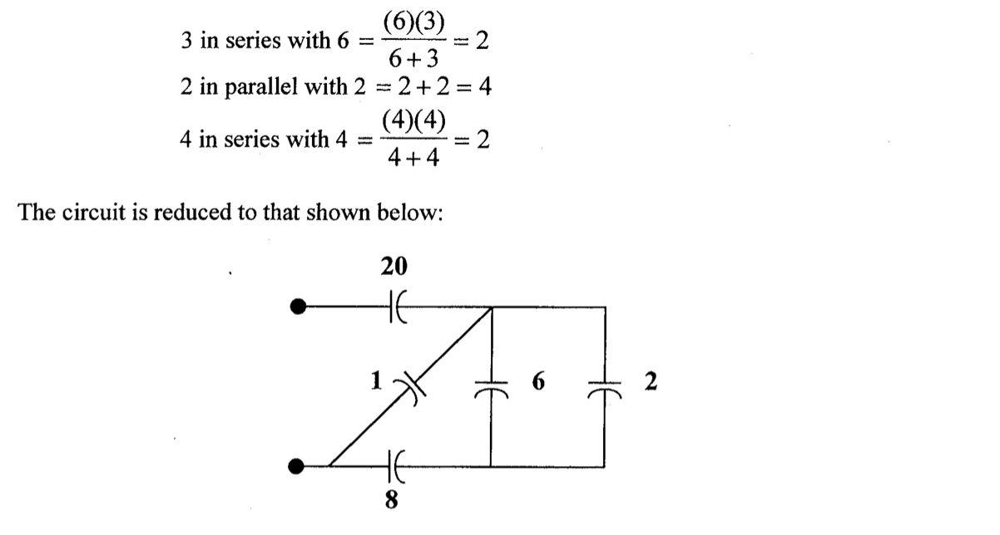 |

`CH02-KP1-10`: 求下图的等效电感

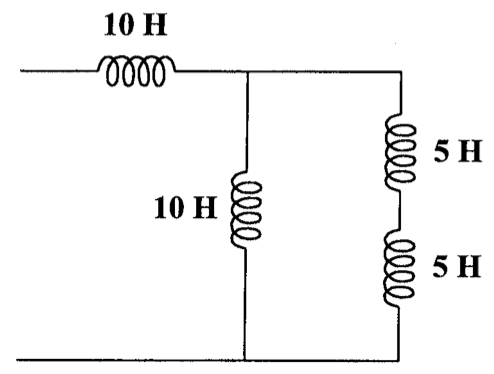

| 参考答案 | 15 H                                                         |
| -------- | ------------------------------------------------------------ |
| 解析     |  |

`CH02-KP1-11`: 右图所示电路的端口等效电阻 $R_{ab}$ 等于_________。

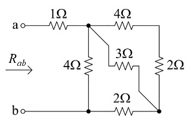

| 参考答案 | $3\,\Omega$                                                  |
| -------- | ------------------------------------------------------------ |
| 解析     | *右上角 4 ohm 和 2 ohm 串联等效为 6 ohm； 再与 3 ohm 并联，等效为2 ohm；再与 2 ohm 串联，等效为 4 ohm； 再与 4 ohm 并联，等效为 2 ohm；最后再与 1 ohm 串联，等效为 3 ohm。* |

## 知识点2：基尔霍夫定律

`CH02-KP2-01`: 基尔霍夫电压定律和电流定律的本质分别是 ________ 。

A. 电荷守恒和能量守恒	

B. 电荷守恒和电荷守恒

C. 能量守恒和能量守恒	

D. 能量守恒和电荷守恒

| 参考答案 | D                                                            |
| -------- | ------------------------------------------------------------ |
| 解析     | *KVL 的本质是能量守恒，因为电压的本意是移动单位电荷所需做的功；KCL 的本质是电荷守恒，因为电流的本意是单位时间内流过某一截面（或某一节点）的电荷量。* |

`CH02-KP2-02`: 基尔霍夫电流定律（KCL）是电流连续性的表现，其本质是 ________ ，基尔霍夫电压定律（KVL）本质是 ________ 。

| 参考答案 | 电荷守恒；能量守恒 |
| -------- | ------------------ |
| 解析     | *同* `CH02-KP2-01` |

`CH02-KP2-03`: 下图中的电流 $I_o$ 是 ________ 。

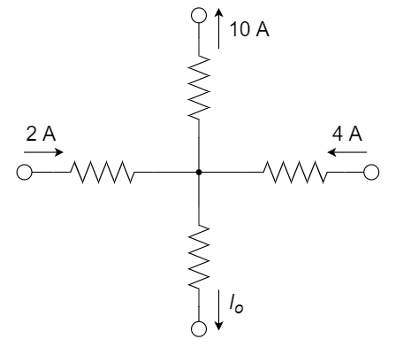

A. 4 A		

B. 16 A		

C. $-4 \rm{A}$		

D. $-6\rm{A}$​

| 参考答案 | C                                                           |
| -------- | ----------------------------------------------------------- |
| 解析     | *流入电流（2+4）= 流出电流（10+$I_o$)，所以 $I_o=6-10=-4A$* |

`CH02-KP2-04`: 分析电路，求$v_x$和$v_o$​

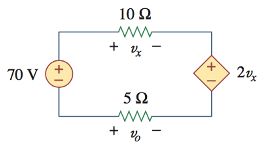

| 参考答案 | $v_x = 20\,\rm{V}$; $v_o = -10\,\rm{V}$                      |
| -------- | ------------------------------------------------------------ |
| 解析     | 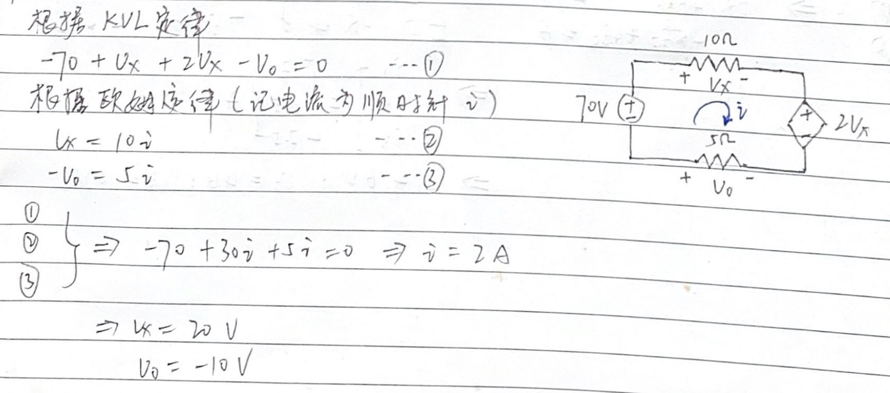 |

`CH02-KP2-05`: 分析电路，求$v_o$, $i_o$

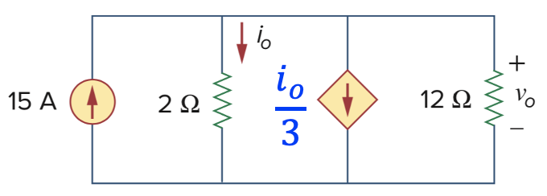

| 参考答案 | $v_o = 20\,\rm{V}$; $i_o = 10\,\rm{A}$                       |
| -------- | ------------------------------------------------------------ |
| 解析     | 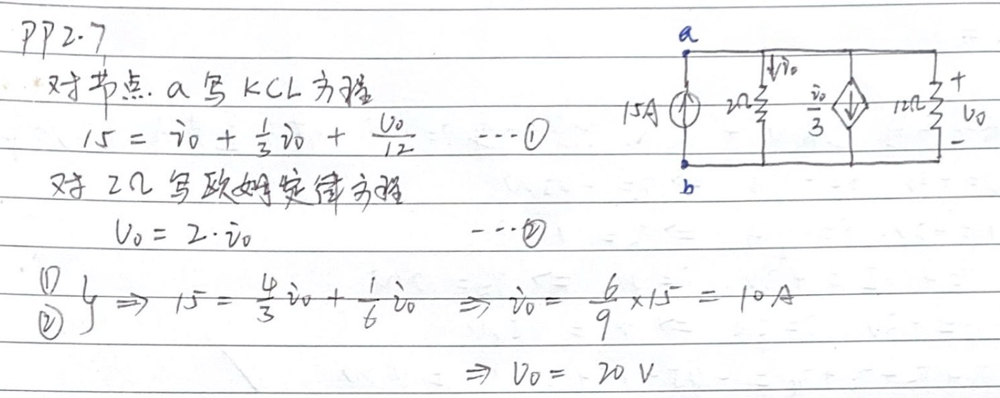 |

`CH02-KP2-06`: 分析电路，求图中标示的所有电压电流

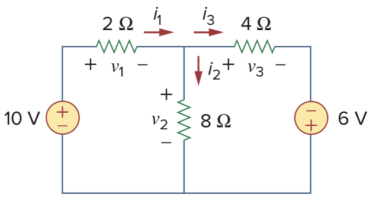

| 参考答案  | $v_1 = 6\,\rm{V}$; $v_2 = 4\,\rm{V}$; $v_3=10\,\rm{V}$; $i_1 = 3\,\rm{A}$; $i_2 = 0.5\,\rm{A}$; $i_3 = 2.5\,\rm{A}$ |
| --------- | ------------------------------------------------------------ |
| 解析      | 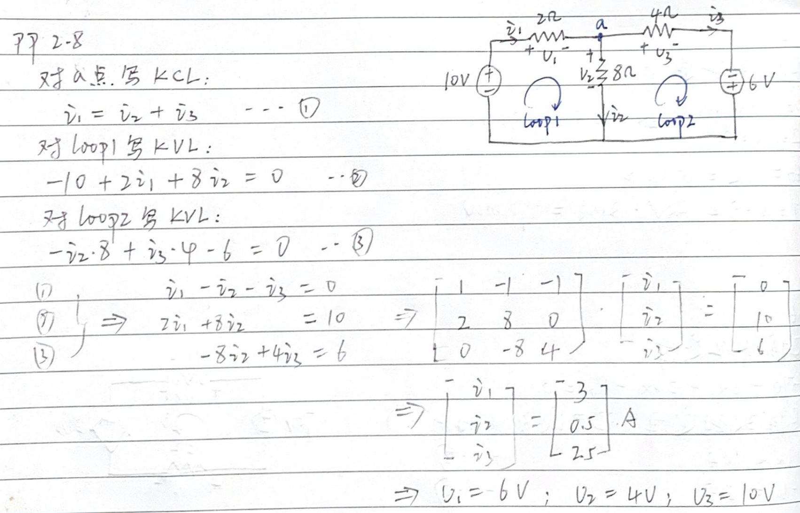 |
| SPICE仿真 | 仿真文件见 Github `kicad/ch2/CH02-KP2-06.kicad_sch` 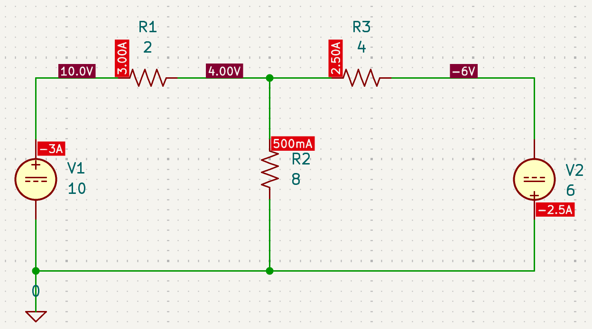 |

`CH02-KP2-07`: 求下图中的 $I$ 和 $V_{ab}$

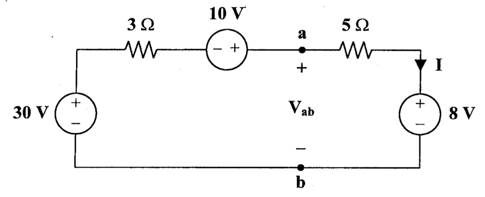

| 参考答案  | $I = 4\,\rm{A}$; $V_{ab} = 28\,\rm{V}$                       |
| --------- | ------------------------------------------------------------ |
| 解析      | 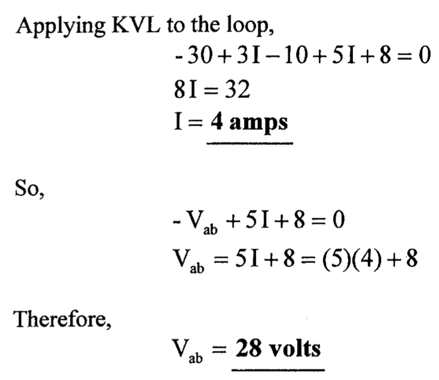 |
| SPICE仿真 | 仿真文件见 Github `kicad/ch2/CH02-KP2-07.kicad_sch` 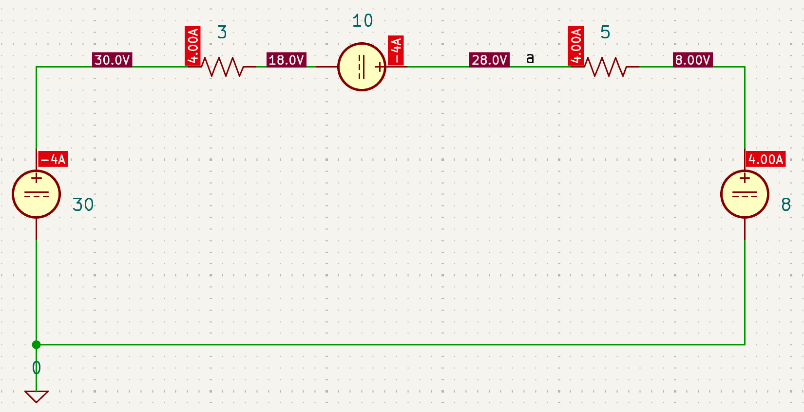 |

`CH02-KP2-08`: 求下图中的 $i_1$ 和 $i_2$

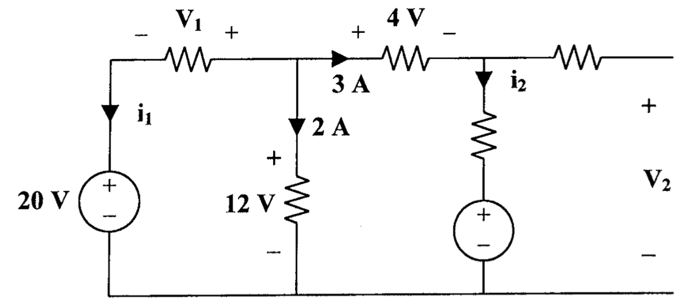

| 参考答案 | $i_1 = -5\,\rm{A}$; $i_2 = 3\,\rm{A}$                        |
| -------- | ------------------------------------------------------------ |
| 解析     | 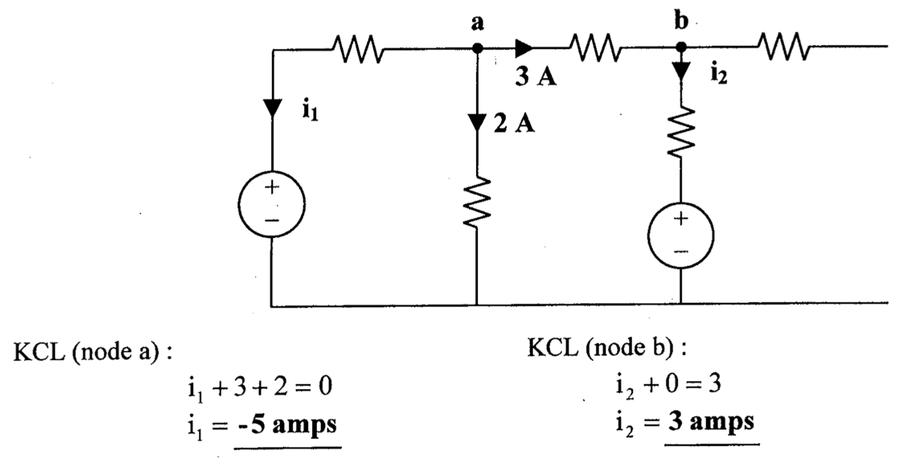 |

## 知识点3：电阻电路的分析

1、右图中，电流 $I$ 为 ________ 。

> $-0.2\rm{A}$，*列KVL方程，* $(3V - 5V)/(4\Omega + 6\Omega) = -0.2A$

2、计算右图中的 $v_o$ 值为 ________ 。

> **3.2 V**，*设左边节点电压为va，对其用KCL方程，则，va/4 + 3 + (va-vo)/2 = 0; 对中间这个节点也用KCL，则(va-vo)/2 = vo/8 + (vo-12)/3；联立两个方程，可求出v0 = 48/15 = 3.2V*

3、下图所示电路中，电压 U 为 ________ 。

A. 4V		

B. 5V		

C. 6V		

D. 3V

> **C**，*对中间右边节点列KCL，则(6-U)/5 + 6 = U/1，解得U= 6V*

4、下图中受控电流源的转移电导 $g=0.01mS$ ，则20 kΩ电阻两端的电压为<u>__  __</u>。

> **2 V**， *vo= 5mA * 10kohm = 50V, gVo = 0.01mS * 50V = 0.5mA，两个电阻分流，20kohm上流过的电流为0.1mA，故其两端电压为2V。*

5、Wheatstone 电桥广泛应用于电阻测量，已知待测电阻 $R_x$ 的阻值范围为 0 ～ 10 Ω，某同学设计了如下电路，其中 *G* 是电流计，问：

(a) 该同学的设计思路是什么（即如何实现电阻测量）？

(b)  $R_1$ 和 $R_2$ 应如何选取？

> (a) 调节 50 Ω 变阻器，当电桥平衡（电流计电流为0）时，通过比值关系获得待测电阻 $R_x$ 的阻值；
>
> (b) 50ohm的可调电阻取值范围为0～50ohm，Rx的取值范围为0～10ohm，所以$R_1$ : $R_2$ 应为 5:1，可选取 100 Ω、20 Ω。

6、求下图所示电路中电流 $I_1$ 和 $I_2$ ，并计算各电源的功率，同时判断该电源是吸收还是发出功率。

> 1. 方法一：
>
>    根据各电流量之间的关系、18 V 和 20 V 电压源在负载上的电压降关系，以及左侧大回路的回路电压降关系，列方程组如下：
>    $$
>    \begin{cases}
>    I_1+I_3+I_4=0 \\
>    I_1+2=I_2 \\
>    I_4=I_5+I_6 \\
>    I_5=\frac{18}{2} \\
>    (-I_3×3)+I_1×3+I_2×4=20 \\
>    I_4×6+I_5×2=I_3×3
>    \end{cases}
>    $$
>    解得：$I_1=2A,I_2=4A,I_3=\frac{2}{3}A,I_4=-\frac{8}{3}A,I_5=9A,I_6=-\frac{35}{3}A$ 
>
>    
>
>    20 V 电压源的功率为： $P=(I_2-2)×(-20V)=-40W$ ，发出功率
>
>    2 A 电流源的功率为： $P=(-2A)×U=(-2A)×(I_2×4Ω+5Ω×2A)=-52W$ ，发出功率
>
>    18 V 电压源的功率为：$18V×I_6=-210W$ ，发出功率
>
>    方法二：
>
>    (1) 等效电路
>
>    
>
>    得：$I_1=\frac{6+20-8}{2+3+4}=2A$ 
>
>    20 V 电压源的功率为 $P=-20V×2A=-40W$ ，发出功率
>
>    (2) 等效电路
>
>    
>
> ​    得：$I_2=\frac{5}{5+4}×(5.2+2)=4A$ 
>
> ​    原电路 $U=5×2+4×4=26V$ 
>
> ​    2 A 电流源的功率为 $P=(-2A)×26V=-52W$ ，发出功率
>
> ​    (3) 18 V 电压源的功率为
>
> ​    $∵3×2+4×4-20-3I_3=0,∴I_3=\frac{2}{3}A$ 
>
> ​    $∵I_4=-(2+\frac{2}{3})=-\frac{8}{3}A ,I_5=\frac{18}{2}=9A$ 
>
> ​    $∴I_6=I_4-I_5=-\frac{8}{3}-9=\frac{-35}{3}A$ 
>
> ​    $∴P=18V×I_6=18×(-\frac{35}{3})W=-210W$ ，发出功率

7、欲使下图所示电路中的支路电流 $I$ = 1 A，试求电流源的输出电流 $I_S$ 。

> $V_{ca}=1Ω×1A=1V,V_{cb}=V_{ca}+V_{ab}=1+2=3V,I_{cb}=\frac{V_{cb}}{1Ω}=3A$ 
>
> $I_{dc}=I+I_{cb}=1+3=4A,V_{da}=V_{dc}+V_{ca}=(I_{dc}×1Ω-2V)+V_{ca}=3V$ 
>
> $I_{da}=\frac{V_{da}}{3Ω}=1A,I_s=I_{da}+I_{dc}=1A+4A=5A$ 

8、如下图所示电路，支路电流 $I$ 的值为 ________ 。

> **3 A**，*上方两个电阻分流，流过2ohm的电流为9A；下方两个电阻分流，流过左边3ohm的电流为6A，所以I=3A*

9、利用如下图所示的惠斯登电桥可以较为精确地测量中等阻值的电阻，其中 $R_1=R_3=1{\rm k \Omega}$ ，调节可调电阻 $R_2$ 使电流表的指示为零，此时称电桥处于平衡状态， ${R_2} = 4{\rm{k}}\Omega$ ，则被测电阻 $R_x$ 的阻值为 ________ 。

> **4 kΩ**，*电桥平衡时，电阻呈比例，R1:R3 = 1:1 = R2:Rx, 所以Rx=4ohm*

10、下图所示电路中，电流 $I$ 的值为 ________ 。

> $\frac{10}{9}{\rm A}$ 。*与电流源串联的电阻不改变电流值；与电压源并联的电阻不改变电压值。设中间节点电压为vx，对最上方节点列KCL: 5 = (vx + 30)/3 + vx/6 + (vx + 30)/16, 可解除vx=-110/9 V，进一步计算出I= (30-110/9)16 =10/9 A* 

11、根据图中的参数，计算 $v_o$。

> 解：
>
> 列方程组如下
>
> $\begin{cases}	-12+4i+2v_o-4+6i=0 \\ i=-\frac{v_o}{6}	\end{cases}$ 	$\Rightarrow$	 $\begin{cases}	i=-8{\rm A} \\ v_o=48{\rm V}	\end{cases}$ 

12、下图所示的电路中的 $i_a=4{\rm A}$，$i_b=-2{\rm A}$，求：

(1)  电流源的输出电流 $i_g$；

(2)  30 Ω 电阻上消耗的功率；

(3)  100 V 电压源提供的功率。

>解：
>
>(1)
>
>
>
>​		$v_2=100+4\times15=160{\rm V}$；		$v_1=160-(9+11+10)\times2=100{\rm V}$ 
>
>​		$i_1=\frac{v_1}{4+16}=\frac{100}{20}=5{\rm A}$；				$i_3=i_1-2=5-2=3{\rm A}$ 
>
>​		$v_g=v_1+30i_3=100+30\times3=190{\rm V}$ 
>
>​		$i_4=2+4=6{\rm A}$ 
>
>​		$i_g=-i_4-i_3=-6-3=-9{\rm A}$ 
>
>(2)	$P_{30{\rm \Omega}}=30\times 3^2=270{\rm W}$ 
>
>(3)	按关联参考方向，$P=100 \times 4=400{\rm W}$，所以电源吸收功率 400 W。 

## 知识点4：Y-$\Delta$ 等效变换

1、已知电路中 $\Delta$ 形电路中三个电阻均为 120Ω ，那么转换后的 Y 形电路中的三个电阻分别为 ____ 。

A. 40 Ω、40 Ω、40 Ω				

B. 360 Ω、360 Ω、360 Ω

C. 120 Ω、120 Ω、120 Ω		 

D. 360 Ω、360 Ω、40 Ω

> **A**, *等阻值相等时，delta电阻是Y电阻的三倍，所以为40ohm*

2、求下图电路的等效电阻 $R_{eq}$。

> 

3、求下图所示电路中的支路电流 $I_1、I_2和I_3$ 。

> 首先 $Z_Y=2Ω$ 变换为 $Z_Δ=6Ω$ ； $6Ω$ 与 $1Ω$ 并联得到 $\frac{6}{7}Ω$ ；在 $Δ→Y$ 转换得到 $\frac{2}{7}Ω$ 。
>
> 通过叠加定理或者网孔电流法可计算得到：
> $$
> \begin{cases}\frac{2}{7}I_1+\frac{2}{7}I_3=12 \\\frac{2}{7}I_2+\frac{2}{7}I_3=30 \\I_1+I_2=I_3\end{cases}⇒\begin{cases}I_1=-7A \\I_2=56A \\I_3=49A\end{cases}
> $$
>
> 

4、分析电路，求$R_{ab}$, $i$

> 

## 知识点5：储能电路分析

1、求下图中每个电容两端的电压

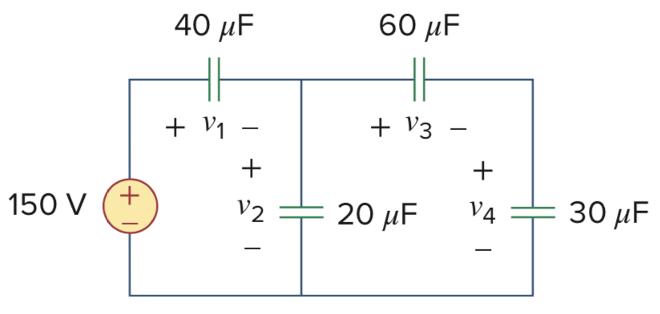

> 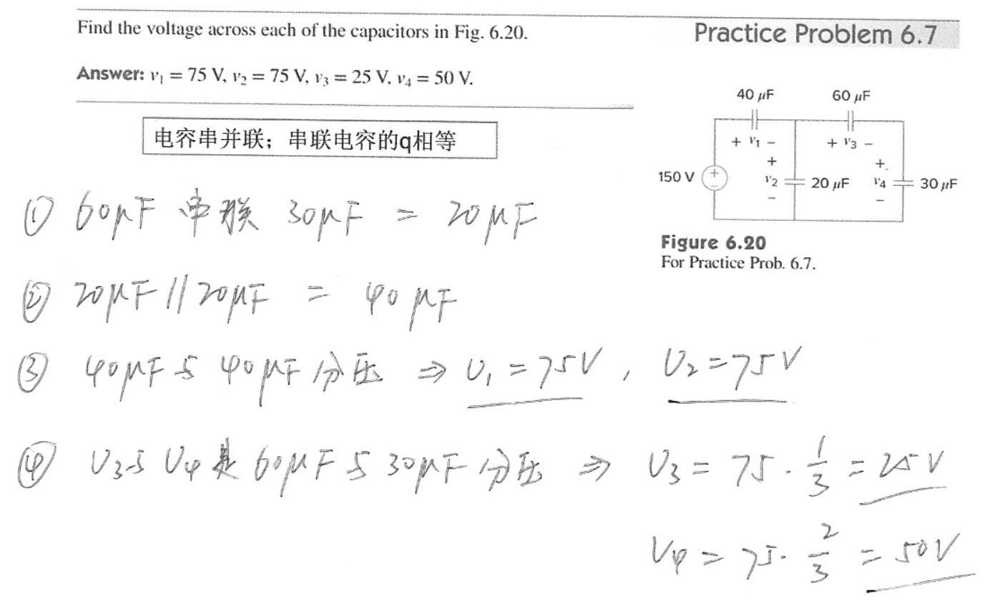

2、求下图中的电容电压、电感电流，以及电容电压的储能

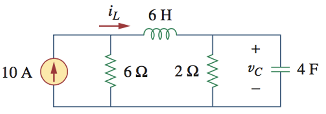

> 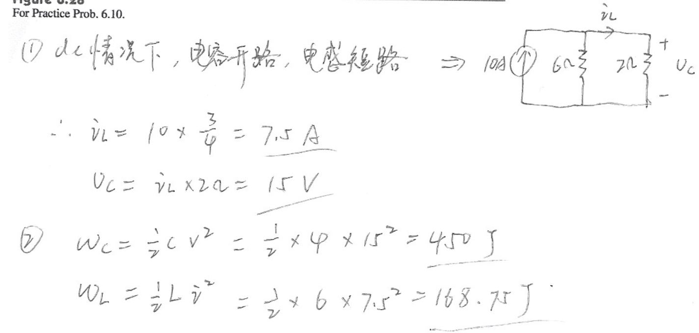

## 知识点6：电源变换

1、采用电源变化，求下图中的 $i_o$

> 
>
> 

